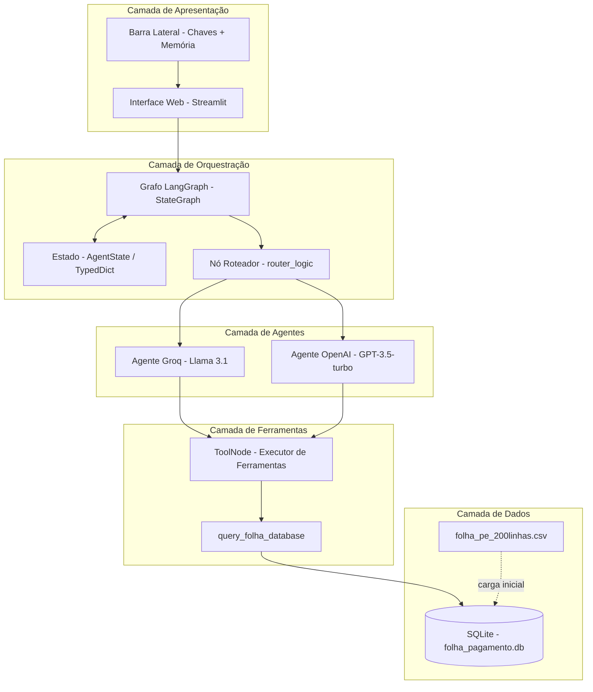
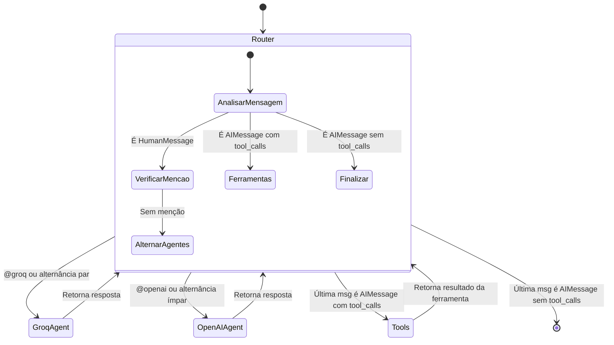
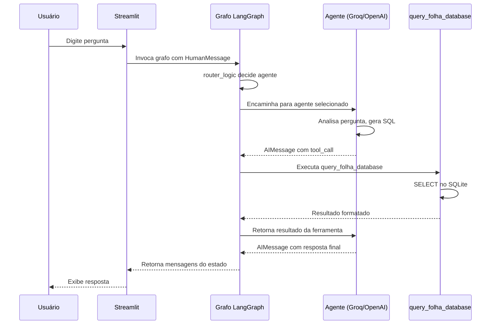
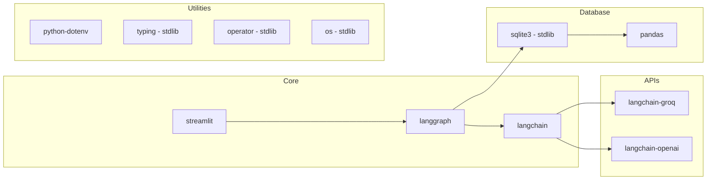
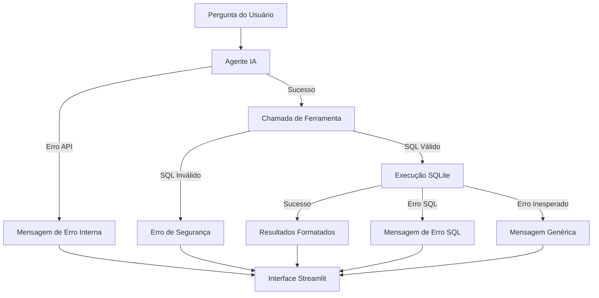

# Conversa_Folha_doc - Arquitetura da Solução

Autor: Guttenberg Ferreira Passos  
Modelo LLM de referência do projeto: Claude Opus 4.6  
Ambiente validado: figmm  
Data: 29 de março de 2026

---

## 1. Visão Geral da Arquitetura

O Conversa com a Folha implementa uma arquitetura multiagente em camadas, baseada em LangGraph, que orquestra consultas interativas sobre dados de folha de pagamento de servidores públicos. A solução combina dois agentes de IA (Groq e OpenAI), uma ferramenta de consulta SQL segura, interface Streamlit e um banco de dados SQLite.

### 1.1 Princípios Arquiteturais

1. **Multiagente com roteamento**: Dois agentes de IA concorrentes com roteamento inteligente por alternância ou menção explícita.
2. **Consulta segura**: Ferramenta SQL restrita a operações SELECT, protegendo contra injeção.
3. **Processamento local de dados**: Banco SQLite local sem envio de dados a servidores externos.
4. **Interface conversacional**: Streamlit com gerenciamento de sessão e histórico de conversa.
5. **Separação de responsabilidades**: Cada componente possui escopo bem definido.

---

## 2. Camadas Arquiteturais

### 2.1 Camada de Apresentação

| Componente | Tecnologia | Responsabilidade |
| --- | --- | --- |
| Interface Web | Streamlit (app.py) | Upload de chaves, entrada de perguntas, exibição de respostas, histórico |
| Barra Lateral | Streamlit sidebar | Chaves de API, memória, histórico da conversa |

### 2.2 Camada de Orquestração

| Componente | Tecnologia | Responsabilidade |
| --- | --- | --- |
| Grafo Principal | LangGraph (StateGraph) | Roteamento, controle de fluxo, alternância entre agentes |
| Estado Compartilhado | TypedDict (AgentState) | Contrato de mensagens entre nós do grafo |
| Nó de Roteamento | route_junction_node | Hub de decisão de roteamento |
| Lógica de Roteamento | router_logic | Decisão de próximo agente com base em menções ou alternância |

### 2.3 Camada de Agentes

| Componente | Tecnologia | Responsabilidade |
| --- | --- | --- |
| Agente Groq | ChatGroq (Llama 3.1-8b-instant) | Responde perguntas sobre folha via SQL |
| Agente OpenAI | ChatOpenAI (GPT-3.5-turbo) | Responde perguntas sobre folha via SQL |
| Template de Prompt | ChatPromptTemplate + MessagesPlaceholder | Estrutura de prompt com sistema e histórico |

### 2.4 Camada de Ferramentas

| Componente | Tecnologia | Responsabilidade |
| --- | --- | --- |
| query_folha_database | @tool (LangChain) | Executa consultas SQL SELECT no SQLite |
| Nó de Ferramentas | ToolNode (LangGraph) | Gerencia execução de ferramentas chamadas pelos agentes |

### 2.5 Camada de Dados

| Componente | Tecnologia | Responsabilidade |
| --- | --- | --- |
| Banco de Dados | SQLite (folha_pagamento.db) | Armazenamento de servidores e folha de pagamento |
| Carga de Dados | pandas + CSV | Importação de dados do CSV para o banco |
| Esquema SQL | criacao_banco.sql | DDL das tabelas |

---

## 3. Diagrama de Arquitetura do Sistema



---

## 4. Padrão de Orquestração

O grafo LangGraph implementa o padrão de **orquestração multiagente com roteamento condicional**, onde um nó roteador central decide qual agente processará cada mensagem.

### 4.1 Diagrama do Grafo de Estados



### 4.2 Nós do Grafo

| Nó | Função | Responsabilidade |
| --- | --- | --- |
| START | Ponto de entrada | Direciona para o roteador |
| router | route_junction_node | Hub de decisão (sem mudança de estado) |
| groq_agent | groq_agent_node | Executa agente Groq com prompt de folha |
| openai_agent | openai_agent_node | Executa agente OpenAI com prompt de folha |
| tools | ToolNode | Executa ferramentas chamadas pelos agentes |
| END | Ponto de saída | Encerra o ciclo atual |

### 4.3 Lógica de Roteamento

A função `router_logic` decide o destino com base em:

1. **Sem mensagens**: encerra o fluxo
2. **AIMessage com tool_calls**: direciona para nó de ferramentas
3. **AIMessage sem tool_calls**: encerra o ciclo (resposta final)
4. **HumanMessage com @openai**: direciona para agente OpenAI
5. **HumanMessage com @groq**: direciona para agente Groq
6. **Sem menção explícita**: alterna entre agentes com base na contagem de AIMessages

### 4.4 Arestas do Grafo

| Origem | Destino | Tipo |
| --- | --- | --- |
| START | router | Fixa |
| router | groq_agent / openai_agent / tools / END | Condicional |
| groq_agent | router | Fixa |
| openai_agent | router | Fixa |
| tools | router | Fixa |

---

## 5. Padrão de Comunicação

### 5.1 Entre Interface e Grafo



### 5.2 Contrato de Estado (AgentState)

```python
class AgentState(TypedDict):
    messages: Annotated[List[BaseMessage], operator.add]
```

O estado é uma lista acumulativa de mensagens (`HumanMessage`, `AIMessage`, `ToolMessage`) agregadas pelo operador de soma.

---

## 6. Padrão de Segurança

### 6.1 Proteção contra Injeção SQL

A ferramenta `query_folha_database` implementa validação de entrada:

1. Verifica se a consulta começa com `SELECT` (case-insensitive)
2. Rejeita operações `UPDATE`, `DELETE`, `INSERT`, `DROP`
3. Registra tentativas de SQL não-SELECT no console

### 6.2 Gerenciamento de Credenciais

- Chaves de API informadas via widgets de senha (type="password")
- Chaves não persistidas (mantidas apenas em session_state)
- Recomendação de não publicar chaves no repositório

### 6.3 Gerenciamento de Conexões

- Conexões SQLite abertas apenas durante a execução da query
- Bloco `finally` garante fechamento da conexão
- Tratamento de exceções para erros SQL e inesperados

---

## 7. Diagrama de Dependências



---

## 8. Padrão de Resiliência

### 8.1 Tratamento de Erros por Camada

| Camada | Erro Tratado | Comportamento |
| --- | --- | --- |
| Inicialização | Banco de dados inexistente | Exibe erro e orienta criação |
| Inicialização | Falha na compilação do grafo | Exibe exceção e interrompe |
| API Groq | Erro de conexão ou quota | Exibe st.error, retorna mensagem de erro interna |
| API OpenAI | Erro de conexão ou quota | Exibe st.error, retorna mensagem de erro interna |
| Ferramenta SQL | Erro SQL ou banco inexistente | Retorna mensagem de erro formatada |
| Ferramenta SQL | SQL não-SELECT | Retorna erro de segurança |

### 8.2 Fluxo de Erro



---

## 9. Observações de Governança

1. A arquitetura foi documentada por análise estática, sem alteração do código original.
2. O padrão multiagente com roteamento permite escalabilidade horizontal (adição de novos agentes).
3. A separação entre ferramenta SQL e agentes permite auditoria independente das consultas.
4. O contrato AgentState garante tipagem estática e rastreabilidade das mensagens.
