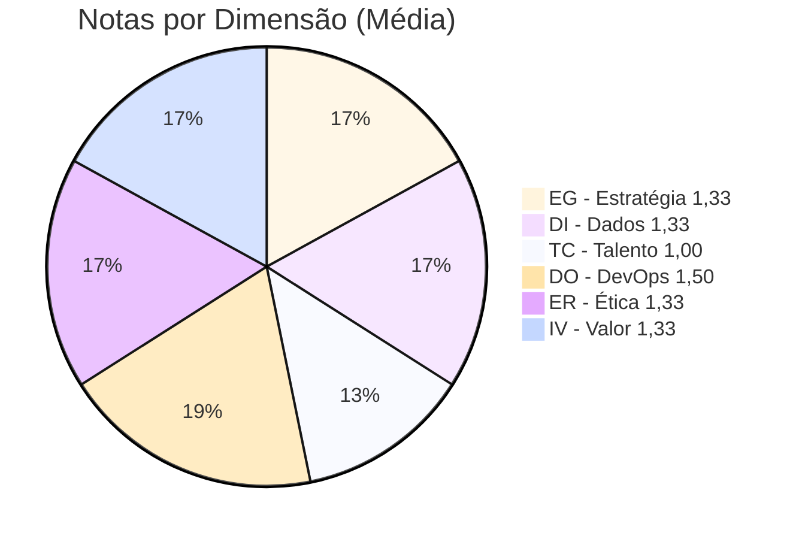
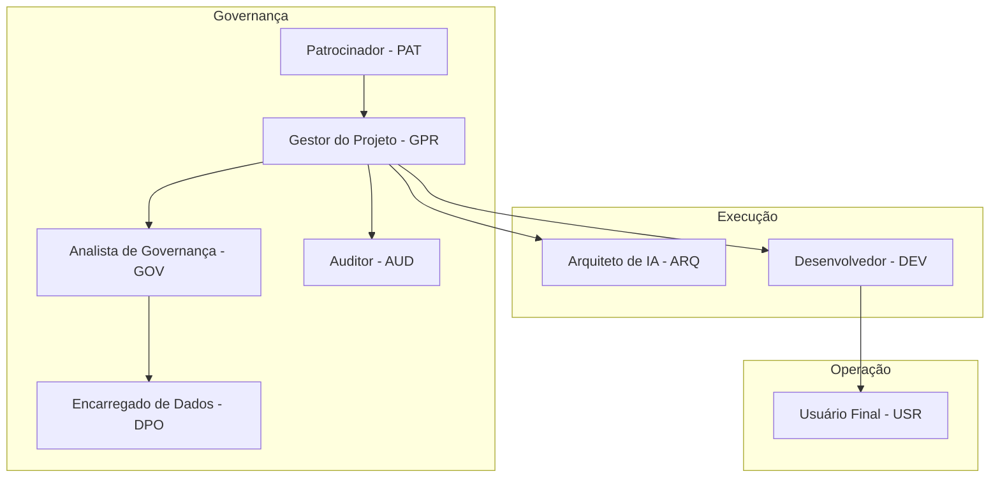

# Conversa_Folha_doc - Avaliação de Maturidade FACIN_IA

Autor: Guttenberg Ferreira Passos  
Modelo LLM utilizado: Claude Opus 4.6  
Ambiente validado: figmm  
Data: 29 de março de 2026

---

## 1. Identificação da Avaliação

- **Projeto avaliado**: Conversa com a Folha de Pagamento — V4
- **Metodologia**: FACIN_IA — Indicadores de Maturidade de Governança Aplicada à Inteligência Artificial
- **Avaliador**: Guttenberg Ferreira Passos
- **Modelo LLM de referência**: Claude Opus 4.6
- **Data da avaliação**: 29 de março de 2026

---

## 2. Objetivo

Avaliar o nível de maturidade do projeto Conversa com a Folha segundo os 18 indicadores prioritários definidos pelo modelo FACIN_IA, distribuídos em 6 dimensões obrigatórias, gerando um índice consolidado de governança de IA. Esta avaliação inclui:

- **Matriz MRO_RACI** — Modelo de Responsabilidade Organizacional
- **Conformidade LGPD** — Lei Geral de Proteção de Dados (Lei 13.709/2018)
- **Resolução CD/ANPD Nº 19/2024** — Regulamento de Comunicação de Incidente de Segurança
- **Avaliação de Risco Algorítmico** — Riscos de IA aplicada à consulta de dados de folha de pagamento

O sistema compreende uma aplicação Streamlit com dois agentes de IA (Groq/Llama 3.1 e OpenAI/GPT-3.5-turbo), orquestrados por LangGraph, com ferramenta SQL para consulta a banco SQLite de folha de pagamento.

---

## 3. Escala de Maturidade

| Nível | Classificação | Descrição |
| --- | --- | --- |
| 1 | Inicial | Inexistente, ad hoc ou informal |
| 2 | Em Desenvolvimento | Parcial, piloto ou dependente de indivíduos |
| 3 | Otimizado | Formalizado, repetível e aplicado nas iniciativas principais |
| 4 | Consolidado | Integrado à governança, monitorado por métricas e com responsabilização |
| 5 | Estabelecido | Otimizado continuamente, auditável, interoperável |

---

## 4. Pesos das Dimensões

| Dimensão | Peso |
| --- | --- |
| Estratégia e Governança de IA | 20% |
| Dados e Infraestrutura | 15% |
| Talento e Cultura | 15% |
| Desenvolvimento e Operação de IA (DevOps/MLOps) | 20% |
| Ética, Transparência e Gestão de Risco | 20% |
| Impacto Social e Valor | 10% |

---

## 5. Avaliação por Dimensão

### 5.1 Estratégia e Governança de IA

#### EG1 — Cobertura de política e estratégia de IA

| Aspecto | Avaliação |
| --- | --- |
| Nota | 1 |
| Nível | Inicial |
| Evidência | O projeto possui README.md e LEIAME.txt com instruções básicas, mas não há política formal de IA, estratégia documentada ou plano de IA institucional. O sistema é uma prova de conceito sem governança formal. |
| Justificativa | Não existe estratégia de IA formalizada, normativa institucional ou mapa estratégico. O projeto é experimental. |

#### EG2 — Governança do portfólio de casos de uso de IA

| Aspecto | Avaliação |
| --- | --- |
| Nota | 1 |
| Nível | Inicial |
| Evidência | O sistema implementa um único caso de uso (consulta conversacional à folha de pagamento) sem portfólio formal, sem estudo de viabilidade, sem patrocinador designado e sem classificação de risco por caso de uso. |
| Justificativa | Caso de uso único sem gestão de portfólio. Não há comitê, priorização ou patrocínio formal. |

#### EG3 — Rastreabilidade de decisões e artefatos de IA

| Aspecto | Avaliação |
| --- | --- |
| Nota | 2 |
| Nível | Em Desenvolvimento |
| Evidência | O sistema registra o histórico de mensagens em `st.session_state.chat_history`. Os prompts dos agentes estão definidos em código (system_prompt). A lógica de roteamento é explícita no código. Porém, não há log persistido, versionamento de prompts formal ou registro decisório. |
| Justificativa | Rastreabilidade parcial: histórico de sessão e prompts em código. Falta persistência, versionamento e auditoria formal. |

**Média da dimensão EG: (1 + 1 + 2) / 3 = 1,33**

---

### 5.2 Dados e Infraestrutura

#### DI1 — Cobertura de catálogo e linhagem de dados e modelos

| Aspecto | Avaliação |
| --- | --- |
| Nota | 2 |
| Nível | Em Desenvolvimento |
| Evidência | Os modelos de IA (Llama 3.1-8b-instant e GPT-3.5-turbo) estão referenciados no código. As tabelas do banco SQLite estão documentadas no SQL de criação. O CSV de origem está identificado. Porém, não há catálogo formal de dados, dicionário de dados ou linhagem documentada. |
| Justificativa | Modelos e fontes identificáveis no código, mas sem catálogo formal ou linhagem documentada. |

#### DI2 — Conformidade de proteção de dados e acessos

| Aspecto | Avaliação |
| --- | --- |
| Nota | 1 |
| Nível | Inicial |
| Evidência | O sistema processa dados pessoais (CPF, nome) de um CSV de exemplo. Não há controle de acesso à interface Streamlit. Não há criptografia do banco de dados. As chaves de API são informadas manualmente sem armazenamento seguro. Os dados de consulta são enviados às APIs externas (Groq/OpenAI). |
| Justificativa | Proteção de dados mínima. Dados pessoais expostos sem controles formais. |

#### DI3 — Disponibilidade da infraestrutura crítica de IA

| Aspecto | Avaliação |
| --- | --- |
| Nota | 1 |
| Nível | Inicial |
| Evidência | O sistema depende de duas APIs externas (Groq e OpenAI) sem monitoramento de disponibilidade, SLAs ou fallbacks entre agentes em caso de falha. Os erros de API são tratados mas não há resiliência proativa. |
| Justificativa | Sem monitoramento, SLAs ou failover entre APIs. Dependência total de serviços externos. |

**Média da dimensão DI: (2 + 1 + 1) / 3 = 1,33**

---

### 5.3 Talento e Cultura

#### TC1 — Cobertura de papéis críticos de IA formalmente atribuídos

| Aspecto | Avaliação |
| --- | --- |
| Nota | 1 |
| Nível | Inicial |
| Evidência | Não há documentação de papéis formais (dono do caso de uso, gestor de dados, gestor de risco, revisor). O código foi desenvolvido sem matriz RACI ou organograma documentado. |
| Justificativa | Papéis críticos não documentados e dependentes de indivíduos. |

#### TC2 — Capacitação aplicada em governança e operação de IA

| Aspecto | Avaliação |
| --- | --- |
| Nota | 1 |
| Nível | Inicial |
| Evidência | Não há registro de trilhas formativas, certificações ou plano de capacitação. O LEIAME.txt contém instruções básicas de execução, mas não constitui material de capacitação formal. |
| Justificativa | Sem programa formal de capacitação em governança de IA. |

#### TC3 — Aderência à segregação entre ideação e produção

| Aspecto | Avaliação |
| --- | --- |
| Nota | 1 |
| Nível | Inicial |
| Evidência | Não há separação formal entre ambientes de desenvolvimento, homologação e produção. O mesmo código é executado localmente e publicado no Streamlit Cloud sem fluxo de aprovação. |
| Justificativa | Sem segregação de ambientes ou fluxo formal de aprovação para produção. |

**Média da dimensão TC: (1 + 1 + 1) / 3 = 1,00**

---

### 5.4 Desenvolvimento e Operação de IA (DevOps/MLOps)

#### DO1 — Cobertura de especificação antes de código

| Aspecto | Avaliação |
| --- | --- |
| Nota | 2 |
| Nível | Em Desenvolvimento |
| Evidência | O sistema possui contrato tipado (`AgentState` com `TypedDict`), prompts estruturados para cada agente, schema da ferramenta SQL documentado na docstring e configuração centralizada do banco de dados. O README descreve arquitetura básica. |
| Justificativa | Especificação técnica parcial: contratos tipados e prompts estruturados. Falta especificação funcional formal anterior ao desenvolvimento. |

#### DO2 — Cobertura de testes e validações

| Aspecto | Avaliação |
| --- | --- |
| Nota | 1 |
| Nível | Inicial |
| Evidência | Não há módulos de teste automatizados no repositório. A validação é feita manualmente via interface Streamlit. A proteção SQL é a única validação automatizada no código. |
| Justificativa | Sem testes automatizados. Validação puramente manual. |

#### DO3 — Cobertura de observabilidade obrigatória

| Aspecto | Avaliação |
| --- | --- |
| Nota | 2 |
| Nível | Em Desenvolvimento |
| Evidência | O sistema implementa `print()` extensivo para debug no console: tipo de mensagem, conteúdo, decisões de roteamento e chamadas de ferramentas. O histórico de chat é visível na sidebar. Porém, não há logging estruturado, painéis de monitoramento ou alertas. |
| Justificativa | Observabilidade via print e histórico de sessão. Falta logging formal, métricas e alertas. |

#### DO4 — Tempo médio de resposta a incidentes (MTTR)

| Aspecto | Avaliação |
| --- | --- |
| Nota | 1 |
| Nível | Inicial |
| Evidência | Não há sistema de incidentes, registro de ocorrências ou análises pós-incidente documentados. |
| Justificativa | Sem gestão formal de incidentes de IA. |

**Média da dimensão DO: (2 + 1 + 2 + 1) / 4 = 1,50**

---

### 5.5 Ética, Transparência e Gestão de Risco

#### ER1 — Cobertura de avaliação ética e de risco algorítmico

| Aspecto | Avaliação |
| --- | --- |
| Nota | 1 |
| Nível | Inicial |
| Evidência | O sistema implementa proteção contra SQL não-SELECT como controle de segurança. Porém, não há avaliação formal de impacto algorítmico, matriz de risco, pareceres éticos ou análise de viés nos agentes. |
| Justificativa | Controle de segurança SQL existe, mas sem avaliação formal de risco algorítmico ou ética. |

#### ER2 — Transparência ao usuário e ao afetado pela IA

| Aspecto | Avaliação |
| --- | --- |
| Nota | 2 |
| Nível | Em Desenvolvimento |
| Evidência | O sistema identifica qual agente está respondendo (Groq ou OpenAI). O histórico é visível na sidebar. Os resultados SQL são apresentados de forma tabular. Porém, não há aviso explícito de que respostas são geradas por IA, disclaimer de precisão ou canal de recurso. |
| Justificativa | Transparência parcial: agente identificado e dados formatados. Falta disclosure de IA e disclaimers. |

#### ER3 — Conformidade ética e regulatória após auditoria

| Aspecto | Avaliação |
| --- | --- |
| Nota | 1 |
| Nível | Inicial |
| Evidência | Não há registros de auditorias, pareceres jurídicos ou revisões de conformidade realizadas sobre o sistema. |
| Justificativa | Sem histórico de auditoria ou revisão de conformidade. |

**Média da dimensão ER: (1 + 2 + 1) / 3 = 1,33**

---

### 5.6 Impacto Social e Valor

#### IV1 — Taxa de metas de valor atingidas

| Aspecto | Avaliação |
| --- | --- |
| Nota | 2 |
| Nível | Em Desenvolvimento |
| Evidência | O sistema demonstra valor funcional como prova de conceito: interface conversacional operacional, dois agentes funcionando, consultas SQL executadas corretamente. Deploy no Streamlit Cloud realizado. Porém, não há metas formais de eficiência, qualidade ou alcance. |
| Justificativa | Valor técnico demonstrável (POC funcional), mas sem metas formais ou métricas de impacto. |

#### IV2 — Cobertura de acessibilidade e inclusão

| Aspecto | Avaliação |
| --- | --- |
| Nota | 1 |
| Nível | Inicial |
| Evidência | O sistema oferece apenas interface web (Streamlit). Não há testes de acessibilidade, linguagem simplificada ou suporte a tecnologias assistivas. A interface é responsiva por padrão do Streamlit. |
| Justificativa | Acessibilidade mínima (responsividade do framework), sem testes ou adaptações formais. |

#### IV3 — Confiança e satisfação do usuário

| Aspecto | Avaliação |
| --- | --- |
| Nota | 1 |
| Nível | Inicial |
| Evidência | Não há pesquisas de satisfação, registros de ouvidoria ou análises de experiência do usuário documentados. |
| Justificativa | Sem dados de confiança ou satisfação do usuário. |

**Média da dimensão IV: (2 + 1 + 1) / 3 = 1,33**

---

## 6. Consolidação dos Resultados

### 6.1 Notas por Dimensão

| Dimensão | Indicadores | Média | Peso |
| --- | --- | --- | --- |
| Estratégia e Governança de IA | EG1=1, EG2=1, EG3=2 | 1,33 | 20% |
| Dados e Infraestrutura | DI1=2, DI2=1, DI3=1 | 1,33 | 15% |
| Talento e Cultura | TC1=1, TC2=1, TC3=1 | 1,00 | 15% |
| Desenvolvimento e Operação de IA | DO1=2, DO2=1, DO3=2, DO4=1 | 1,50 | 20% |
| Ética, Transparência e Gestão de Risco | ER1=1, ER2=2, ER3=1 | 1,33 | 20% |
| Impacto Social e Valor | IV1=2, IV2=1, IV3=1 | 1,33 | 10% |

### 6.2 Cálculo do Índice Geral de Maturidade

$$\text{Índice Geral} = \sum_{i=1}^{6} \text{Média}_i \times \text{Peso}_i$$

$$= (1{,}33 \times 0{,}20) + (1{,}33 \times 0{,}15) + (1{,}00 \times 0{,}15) + (1{,}50 \times 0{,}20) + (1{,}33 \times 0{,}20) + (1{,}33 \times 0{,}10)$$

$$= 0{,}267 + 0{,}200 + 0{,}150 + 0{,}300 + 0{,}267 + 0{,}133$$

$$= 1{,}32$$

### 6.3 Classificação

| Faixa | Nível | Resultado |
| --- | --- | --- |
| **1,0 a 1,8** | **Nível 1 — Inicial** | **← Conversa com a Folha: 1,32** |
| acima de 1,8 a 2,6 | Nível 2 — Em Desenvolvimento | |
| acima de 2,6 a 3,4 | Nível 3 — Otimizado | |
| acima de 3,4 a 4,2 | Nível 4 — Consolidado | |
| acima de 4,2 a 5,0 | Nível 5 — Estabelecido | |

### 6.4 Diagrama de Maturidade

---

## 7. Matriz MRO_RACI — Modelo de Responsabilidade Organizacional

### 7.1 Objetivo

A Matriz MRO_RACI formaliza os papéis e responsabilidades organizacionais do projeto Conversa com a Folha segundo o Modelo de Responsabilidade Organizacional (MRO), integrando-se ao padrão RACI (Responsible, Accountable, Consulted, Informed) do FACIN_IA.

### 7.2 Papéis Organizacionais

| Código | Papel | Descrição |
| --- | --- | --- |
| PAT | Patrocinador Executivo | Aprova escopo, garante recursos, responde institucionalmente |
| GPR | Gestor do Projeto | Coordena execução, monitora progresso, escala riscos |
| ARQ | Arquiteto de IA | Define e valida arquitetura, integrações e padrões |
| GOV | Analista de Governança | Avalia maturidade, conformidade regulatória, risco algorítmico |
| DEV | Desenvolvedor | Implementa código, gera documentação, executa testes |
| AUD | Auditor | Revisa aderência, valida critérios de aceite |
| DPO | Encarregado de Dados (DPO) | Garante conformidade LGPD, monitora tratamento de dados |
| USR | Usuário Final | Opera o sistema, fornece feedback, utiliza consultas |

### 7.3 Matriz de Responsabilidades

| Atividade / Entrega | PAT | GPR | ARQ | GOV | DEV | AUD | DPO | USR |
| --- | --- | --- | --- | --- | --- | --- | --- | --- |
| Definição de escopo do projeto | A | R | C | I | I | I | I | I |
| Aprovação de política de IA | A | C | C | R | I | I | C | I |
| Especificação da arquitetura multiagente | I | A | R | I | C | I | I | I |
| Desenvolvimento do app.py | I | A | C | I | R | I | I | I |
| Desenvolvimento do cria_db.py | I | A | C | I | R | I | I | I |
| Definição do schema SQL | I | A | R | I | C | I | C | I |
| Documentação do código | I | A | C | I | R | I | I | I |
| Manual de usuário | I | A | C | I | R | C | I | C |
| Avaliação de maturidade FACIN_IA | A | C | C | R | C | C | I | I |
| Avaliação de risco algorítmico | A | I | C | R | C | C | C | I |
| Conformidade LGPD | A | I | I | C | I | C | R | I |
| Resolução ANPD 19/2024 | A | I | I | C | I | C | R | I |
| Configuração de chaves de API | I | I | I | I | I | I | I | R |
| Testes automatizados | I | A | C | I | R | C | I | I |
| Gestão de incidentes de IA | A | R | C | C | C | I | C | I |
| Monitoramento e observabilidade | I | R | C | C | C | I | I | I |
| Validação em homologação | I | A | C | I | R | C | I | R |
| Publicação documental (.md/.html/.pdf) | I | A | I | I | R | I | I | I |
| Aprovação de release | A | R | C | C | I | C | I | I |
| Treinamento de operadores | I | A | C | C | C | I | I | R |
| Pesquisa de satisfação | I | R | I | I | I | I | I | R |

### 7.4 Diagrama de Governança MRO

### 7.5 Lacunas Identificadas no MRO

| Lacuna | Impacto | Recomendação |
| --- | --- | --- |
| PAT não designado formalmente | Sem aprovador institucional | Designar patrocinador executivo |
| DPO não atribuído | Conformidade LGPD informal | Designar encarregado de proteção de dados |
| AUD não ativado | Sem validação independente | Programar auditoria de governança |
| USR sem canal de feedback | Sem métricas de satisfação | Implementar pesquisa de satisfação |
| DEV sem testes automatizados | Risco de regressão | Implementar suite de testes pytest |

---

## 8. Conformidade LGPD — Lei Geral de Proteção de Dados

### 8.1 Objetivo

Avaliar a conformidade do sistema Conversa com a Folha com a Lei 13.709/2018 (LGPD), identificando os tipos de dados pessoais tratados, as bases legais aplicáveis, os controles implementados e as lacunas que requerem ação.

### 8.2 Dados Pessoais Tratados pelo Sistema

| Dado | Categoria LGPD | Módulo que Utiliza | Tratamento |
| --- | --- | --- | --- |
| CPF | Dado pessoal | app.py (via SQL), cria_db.py (carga) | Armazenado em SQLite, consultável via agentes |
| Nome | Dado pessoal | app.py (via SQL), cria_db.py (carga) | Armazenado em SQLite, consultável via agentes |
| Matrícula | Dado pessoal | app.py (via SQL), cria_db.py (carga) | Chave de relacionamento entre tabelas |
| Órgão de lotação | Dado pessoal | app.py (via SQL), cria_db.py (carga) | Filtro de consulta |
| Cargo | Dado pessoal | app.py (via SQL), cria_db.py (carga) | Filtro de consulta |
| Vencimentos | Dado pessoal sensível* | app.py (via SQL), cria_db.py (carga) | Dados financeiros de remuneração |
| Descontos | Dado pessoal sensível* | app.py (via SQL), cria_db.py (carga) | Dados financeiros |
| Líquido | Dado pessoal sensível* | app.py (via SQL), cria_db.py (carga) | Dados financeiros |

*Dados de remuneração podem ser considerados sensíveis no contexto de administração pública.

### 8.3 Bases Legais Aplicáveis (Art. 7º LGPD)

| Base Legal | Artigo | Aplicabilidade |
| --- | --- | --- |
| Execução de políticas públicas | Art. 7º, III | **Aplicável** — gestão de folha de pagamento é atividade de política pública |
| Cumprimento de obrigação legal | Art. 7º, II | **Aplicável** — transparência de remuneração de servidores tem base legal |
| Legítimo interesse | Art. 7º, IX | Subsidiária — interesse do gestor em consultar a folha |

### 8.4 Princípios LGPD Avaliados (Art. 6º)

| Princípio | Artigo | Status | Avaliação |
| --- | --- | --- | --- |
| Finalidade | Art. 6º, I | ⚠️ Parcial | Sistema tem finalidade de consulta, mas não há declaração formal de finalidade |
| Adequação | Art. 6º, II | ✅ Conforme | Dados tratados compatíveis com objetivo de consulta de folha |
| Necessidade | Art. 6º, III | ⚠️ Parcial | CPF completo armazenado; sem análise de minimização |
| Livre acesso | Art. 6º, IV | ❌ Lacuna | Titulares (servidores) não são notificados sobre o tratamento |
| Qualidade dos dados | Art. 6º, V | ⚠️ Parcial | Dados carregados de CSV de exemplo; não há validação formal |
| Transparência | Art. 6º, VI | ❌ Lacuna | Sem aviso de tratamento ao titular |
| Segurança | Art. 6º, VII | ⚠️ Parcial | Proteção SQL implementada, mas sem criptografia ou controle de acesso |
| Prevenção | Art. 6º, VIII | ⚠️ Parcial | Validação de SELECT, mas sem DPIAs formais |
| Não discriminação | Art. 6º, IX | ✅ Conforme | Sistema não discrimina; consultas baseadas em dados objetivos |
| Responsabilização | Art. 6º, X | ❌ Lacuna | Sem DPO designado, sem relatório de impacto |

### 8.5 Direitos do Titular (Art. 18 LGPD)

| Direito | Aplicabilidade | Status |
| --- | --- | --- |
| Confirmação de tratamento | Aplicável | ❌ Não implementado |
| Acesso aos dados | Aplicável | ⚠️ Via consulta SQL apenas |
| Correção de dados | Aplicável | ❌ Sistema somente leitura |
| Anonimização / bloqueio | Aplicável | ❌ CPF em texto claro |
| Eliminação | Parcial | ⚠️ Dados de exemplo podem ser removidos |
| Portabilidade | Aplicável (dados de exemplo) | ⚠️ CSV e Excel gerados na carga |
| Revogação de consentimento | Não se aplica | — Base legal não é consentimento |

### 8.6 Avaliação de Conformidade Consolidada

| Aspecto | Nota (1-5) | Status |
| --- | --- | --- |
| Base legal definida | 3 | ⚠️ Implícita, não formalizada |
| Finalidade e adequação | 3 | ⚠️ Clara no código, não documentada formalmente |
| Necessidade e minimização | 1 | ❌ CPF completo sem máscara |
| Transparência ao titular | 1 | ❌ Não implementada |
| Segurança técnica | 2 | ⚠️ Proteção SQL, sem criptografia |
| DPO / Encarregado | 1 | ❌ Não designado |
| DPIA / RIPD | 1 | ❌ Não realizado |
| Registro de atividades de tratamento | 1 | ❌ Não documentado |
| **Média** | **1,63** | **Inicial** |

### 8.7 Risco LGPD: Envio de Dados a APIs Externas

**Risco crítico identificado**: O sistema envia o conteúdo das perguntas e resultados SQL (que podem conter dados pessoais como CPF, nome, remuneração) para as APIs externas Groq e OpenAI. Isso configura **transferência internacional de dados pessoais** (Art. 33 LGPD) sem garantias adequadas documentadas.

| Aspecto | Estado |
| --- | --- |
| Cláusulas contratuais padrão | Não verificadas |
| Adequação do país terceiro | Não avaliada |
| Consentimento específico do titular | Não obtido |
| Recomendação | Implementar anonimização antes do envio ou usar LLM local |

---

## 9. Conformidade com Resolução CD/ANPD Nº 19, de 23 de agosto de 2024

### 9.1 Contexto

A Resolução CD/ANPD Nº 19/2024 regulamenta a **comunicação de incidente de segurança** que possa acarretar risco ou dano relevante aos titulares de dados pessoais, nos termos do Art. 48 da LGPD.

### 9.2 Aplicabilidade ao Sistema

O Conversa com a Folha trata dados pessoais (CPF, nome, remuneração) de servidores públicos. A ocorrência de um incidente de segurança — especialmente considerando o envio de dados a APIs externas — exigiria comunicação à ANPD conforme esta Resolução.

### 9.3 Avaliação de Conformidade por Dispositivo

| Dispositivo | Requisito | Status | Recomendação |
| --- | --- | --- | --- |
| Art. 3º | Comunicar incidente à ANPD e ao titular em prazo razoável | ❌ Não implementado | Definir processo de comunicação de incidentes |
| Art. 4º | Comunicação com natureza dos dados, titulares afetados, medidas | ❌ Sem inventário | Criar inventário de dados por componente |
| Art. 5º | Prazo de 3 dias úteis para comunicação à ANPD | ❌ Sem processo | Estabelecer SLA de comunicação |
| Art. 6º | Comunicação ao titular clara e acessível | ❌ Sem canal | Definir canal de comunicação |
| Art. 7º | Registro de incidentes de segurança | ❌ Sem registro | Implementar registro de incidentes |
| Art. 8º | Medidas de contenção e remediação | ⚠️ Parcial | Proteção SQL existe; falta plano formal |
| Art. 10 | Avaliação de risco do incidente | ❌ Sem processo | Criar matriz de avaliação de risco |

### 9.4 Matriz de Risco de Incidentes

| Cenário de Incidente | Probabilidade | Impacto | Risco | Controle Existente |
| --- | --- | --- | --- | --- |
| Exposição de CPF via API externa (Groq/OpenAI) | Alta | Alto | Crítico | Nenhum (dados enviados em texto claro) |
| Acesso não autorizado à interface Streamlit | Média | Alto | Alto | Sem autenticação (protótipo) |
| Injeção SQL via agente de IA | Baixa | Alto | Médio | Validação SELECT implementada |
| Vazamento de chaves de API | Média | Médio | Médio | Widgets de senha + não persistência |
| Acesso indevido ao arquivo SQLite | Baixa | Médio | Baixo | Acesso local ao arquivo |

---

## 10. Avaliação de Risco Algorítmico

### 10.1 Objetivo

Avaliar os riscos específicos do uso de modelos de linguagem (LLM) para geração de consultas SQL e respostas sobre dados de folha de pagamento de servidores públicos.

### 10.2 Riscos Identificados

#### RA-01: Alucinação do LLM na Geração de SQL

| Aspecto | Avaliação |
| --- | --- |
| Descrição | O agente pode gerar SQL sintaticamente válido mas semanticamente incorreto (ex: usar nome de coluna inexistente ou interpretar incorretamente a pergunta) |
| Probabilidade | Média |
| Impacto | Médio (dados incorretos apresentados como corretos) |
| Risco | Médio |
| Controle existente | Schema documentado na docstring da ferramenta |
| Recomendação | Adicionar validação de schema antes da execução; implementar disclaimer de precisão |

#### RA-02: Exposição Indevida de Dados Pessoais

| Aspecto | Avaliação |
| --- | --- |
| Descrição | O agente pode retornar dados pessoais (CPF, nome, remuneração) sem necessidade, em resposta a perguntas genéricas |
| Probabilidade | Alta |
| Impacto | Alto (violação de privacidade) |
| Risco | Alto |
| Controle existente | Nenhum controle de minimização |
| Recomendação | Implementar mascaramento de CPF; limitar colunas retornadas por tipo de pergunta |

#### RA-03: Viés na Alternância de Agentes

| Aspecto | Avaliação |
| --- | --- |
| Descrição | A alternância automática pode favorecer um agente em detrimento de outro, gerando respostas de qualidade desigual |
| Probabilidade | Baixa |
| Impacto | Baixo (inconsistência na experiência do usuário) |
| Risco | Baixo |
| Controle existente | Alternância determinística (par/ímpar) |
| Recomendação | Implementar avaliação de qualidade por agente; permitir preferência do usuário |

#### RA-04: Transferência de Dados Pessoais a APIs Externas

| Aspecto | Avaliação |
| --- | --- |
| Descrição | Dados pessoais (CPF, nome, remuneração) contidos nos resultados SQL são enviados como contexto às APIs Groq e OpenAI |
| Probabilidade | Alta |
| Impacto | Alto (transferência internacional sem garantias) |
| Risco | Crítico |
| Controle existente | Nenhum |
| Recomendação | Anonimizar dados antes do envio ou migrar para LLM local |

#### RA-05: Prompt Injection via Mensagem do Usuário

| Aspecto | Avaliação |
| --- | --- |
| Descrição | O usuário pode manipular o prompt do sistema via entrada maliciosa para alterar o comportamento do agente |
| Probabilidade | Média |
| Impacto | Médio (geração de SQL não previsto ou bypass do prompt) |
| Risco | Médio |
| Controle existente | Validação SELECT na ferramenta SQL |
| Recomendação | Implementar sanitização de entrada e guardrails adicionais |

#### RA-06: Inconsistência entre Respostas dos Agentes

| Aspecto | Avaliação |
| --- | --- |
| Descrição | Groq e OpenAI podem fornecer respostas divergentes para a mesma pergunta, confundindo o usuário |
| Probabilidade | Média |
| Impacto | Baixo (confiança do usuário diminuída) |
| Risco | Baixo |
| Controle existente | Ambos usam o mesmo prompt e ferramenta |
| Recomendação | Documentar que respostas podem variar; considerar consenso entre agentes |

#### RA-07: Dependência de APIs Externas

| Aspecto | Avaliação |
| --- | --- |
| Descrição | O sistema é inoperável se ambas as APIs estiverem indisponíveis |
| Probabilidade | Baixa |
| Impacto | Alto (sistema totalmente indisponível) |
| Risco | Médio |
| Controle existente | Tratamento de exceção por agente |
| Recomendação | Implementar fallback local ou cache de respostas |

#### RA-08: Custo não Controlado de APIs

| Aspecto | Avaliação |
| --- | --- |
| Descrição | Uso extensivo pode gerar custos não controlados nas APIs Groq e OpenAI |
| Probabilidade | Média |
| Impacto | Médio (custo financeiro) |
| Risco | Médio |
| Controle existente | Nenhum controle de quota ou orçamento |
| Recomendação | Implementar limites de requisições por sessão |

#### RA-09: Falta de Auditoria de Consultas

| Aspecto | Avaliação |
| --- | --- |
| Descrição | Consultas SQL executadas não são persistidas para auditoria posterior |
| Probabilidade | Alta |
| Impacto | Médio (impossibilidade de auditoria) |
| Risco | Médio |
| Controle existente | print() no console (volátil) |
| Recomendação | Implementar logging persistente de consultas SQL |

#### RA-10: Limitação de Contexto do Agente

| Aspecto | Avaliação |
| --- | --- |
| Descrição | O agente pode não entender perguntas complexas ou ambíguas sobre a folha, gerando SQL inadequado |
| Probabilidade | Média |
| Impacto | Baixo (resposta incorreta ou vazia) |
| Risco | Baixo |
| Controle existente | Prompt com exemplos de SQL e schema |
| Recomendação | Melhorar prompt com mais exemplos e guardrails |

### 10.3 Consolidação de Riscos Algorítmicos

| Risco | Prob. | Impacto | Nível | Ação Prioritária |
| --- | --- | --- | --- | --- |
| RA-04: Transferência de dados a APIs | Alta | Alto | Crítico | Anonimizar ou usar LLM local |
| RA-02: Exposição de dados pessoais | Alta | Alto | Alto | Mascaramento de CPF |
| RA-01: Alucinação SQL | Média | Médio | Médio | Validação de schema |
| RA-05: Prompt injection | Média | Médio | Médio | Sanitização de entrada |
| RA-09: Falta de auditoria | Alta | Médio | Médio | Logging persistente |
| RA-08: Custo de APIs | Média | Médio | Médio | Controle de quota |
| RA-07: Dependência de APIs | Baixa | Alto | Médio | Fallback local |
| RA-06: Inconsistência agentes | Média | Baixo | Baixo | Documentação |
| RA-03: Viés alternância | Baixa | Baixo | Baixo | Preferência do usuário |
| RA-10: Limitação contexto | Média | Baixo | Baixo | Melhorar prompt |

---

## 11. Plano de Adequação — Roadmap de Melhoria

### 11.1 Fase 1 — Ações Imediatas (Curto Prazo)

| Ação | Responsável (RACI) | Risco Mitigado | Evidência Esperada |
| --- | --- | --- | --- |
| Mascarar CPF no banco (exibir parcial) | DEV | RA-02 | CPF exibido como ***.XXX.XXX-** |
| Implementar anonimização antes de envio às APIs | DEV/ARQ | RA-04 | Dados pessoais não enviados a Groq/OpenAI |
| Implementar logging persistente de consultas | DEV | RA-09 | Arquivo de log com SQL executado |
| Adicionar disclaimer de IA na interface | DEV | ER2 | Aviso visível na interface |

### 11.2 Fase 2 — Estruturação (Médio Prazo)

| Ação | Responsável (RACI) | Risco Mitigado | Evidência Esperada |
| --- | --- | --- | --- |
| Designar DPO e PAT formalmente | GPR/PAT | DI2, LGPD | Documento com designações |
| Implementar autenticação na interface | DEV/ARQ | Incidente | Login obrigatório |
| Criar suite de testes automatizados | DEV | DO2 | pytest com cobertura documentada |
| Implementar DPIA / RIPD | GOV/DPO | LGPD | Relatório de impacto publicado |
| Validar schema SQL antes de execução | DEV | RA-01 | Whitelist de tabelas/colunas |

### 11.3 Fase 3 — Consolidação (Longo Prazo)

| Ação | Responsável (RACI) | Risco Mitigado | Evidência Esperada |
| --- | --- | --- | --- |
| Migrar para LLM local (eliminar APIs externas) | ARQ/DEV | RA-04, RA-07 | Ollama ou similar local |
| Implementar monitoramento e alertas | DEV/ARQ | DI3, DO4 | Dashboard de saúde do sistema |
| Programar auditoria de governança | AUD/GOV | ER3 | Relatório de auditoria |
| Implementar pesquisa de satisfação | GPR | IV3 | Formulário e resultados |
| Formalizar política de IA institucional | PAT/GOV | EG1 | Documento aprovado |

---

## 12. Observações Finais

1. O sistema Conversa com a Folha está no **Nível 1 — Inicial** de maturidade de governança de IA, compatível com seu estágio de prova de conceito.
2. O risco mais crítico identificado é a **transferência de dados pessoais a APIs externas** (RA-04), que requer ação imediata antes de uso com dados reais.
3. A proteção SQL contra operações destrutivas (RN-06) é o controle de segurança mais relevante já implementado.
4. A evolução para o Nível 2 requer, minimamente: mascaramento de CPF, logging persistente, disclaimer de IA e designação de DPO.
5. O sistema não deve ser utilizado com dados reais de servidores sem a implementação das ações da Fase 1.
6. A documentação FACIN_IA gerada neste projeto constitui a base para evolução futura da governança.
