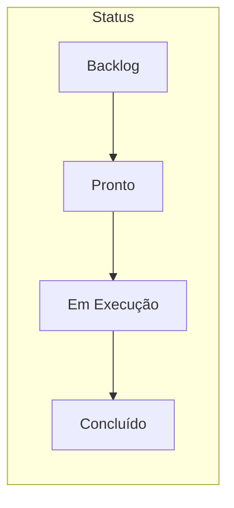

# Conversa_Folha_doc - Backlog Kanban

Autor: Guttenberg Ferreira Passos  
Modelo LLM de referência do projeto: Claude Opus 4.6  
Ambiente validado: figmm  
Data: 29 de março de 2026

---

## 1. Finalidade

Visão operacional do backlog do projeto Conversa_Folha_doc em formato Kanban, com colunas de status para rastreamento de progresso.

---

## 2. Quadro Kanban

### 2.1 Concluído ✅

| Item | Sprint | Tipo |
| --- | --- | --- |
| Estrutura de pastas Conversa_Folha_doc | 1 | Infraestrutura |
| Conversa_Folha_Projeto.md | 1 | Documental |
| Conversa_Folha_Documentacao_Codigo.md | 1 | Documental |
| Conversa_Folha_Manual_Usuario.md | 1 | Documental |
| Conversa_Folha_Arquitetura_Solucao.md | 2 | Documental |
| Conversa_Folha_Tecnologias.md | 2 | Documental |
| Conversa_Folha_Integracoes.md | 2 | Documental |
| Conversa_Folha_Regras_Negocio.md | 2 | Documental |
| Conversa_Folha_Avaliacao_Maturidade.md (com MRO_RACI, LGPD, Risco) | 3 | Governança |
| Conversa_Folha_Erros_Resolvidos.md | 3 | Qualidade |
| Conversa_Folha_Backlog_Sprints.md | 3 | Gestão |
| Conversa_Folha_Backlog_Kanban.md | 3 | Gestão |
| Conversa_Folha_Plano_Executivo.md | 4 | Documental |
| Conversa_Folha_Kanban_Executivo.md | 4 | Documental |
| Conversa_Folha_Indice_Executivo.md | 4 | Documental |
| Geração de versões HTML | 4 | Publicação |
| Geração de versões PDF | 4 | Publicação |
| Revisão de conformidade LGPD completa | 4 | Regulatório |
| Avaliação de riscos algorítmicos | 4 | Governança |
| Documentação de controles e lacunas | 4 | Governança |
| README.md do projeto | 5 | Documental |
| Conversa_Folha_Dashboard_Executivo.html | 5 | Publicação |

### 2.2 Em Execução 🔄

| Item | Sprint | Tipo |
| --- | --- | --- |
| Revisão por pares | 5 | Qualidade |

### 2.3 Pronto (Aguardando Execução) 📋

| Item | Sprint | Tipo |
| --- | --- | --- |
| (Todos os itens anteriores foram concluídos) | — | — |

### 2.4 Backlog (Futuro) 📝

| Item | Sprint | Tipo |
| --- | --- | --- |
| Implementação das ações do Plano de Adequação (Fases 1 a 3) | 6+ | Evolução |
| Mascaramento de CPF e anonimização de dados | 6 | Segurança |
| Autenticação na interface Streamlit | 6 | Segurança |
| Migração para LLM local | 7+ | Infraestrutura |
| Testes automatizados (pytest) | 6 | Qualidade |

---

## 3. Métricas Operacionais

| Métrica | Valor |
| --- | --- |
| Total de itens | 27 |
| Concluídos | 22 |
| Em execução | 1 |
| Prontos | 0 |
| Backlog futuro | 5 |
| Velocidade média | ~10 pontos/sprint |
| Taxa de conclusão | 81% |

---

## 4. Bloqueios Ativos

| Bloqueio | Impacto | Ação |
| --- | --- | --- |
| Nenhum bloqueio ativo | — | — |

---

## 5. Fluxo Kanban

---

## 6. Observações

1. O quadro reflete o estado do projeto em 29 de março de 2026.
2. Itens foram gerados com Claude Opus 4.6 no ambiente figmm.
3. O código original na pasta `Conversa_Folha/` não foi alterado.
4. A documentação segue o template FACIN_IA e está disponível em .md, .html e .pdf.
