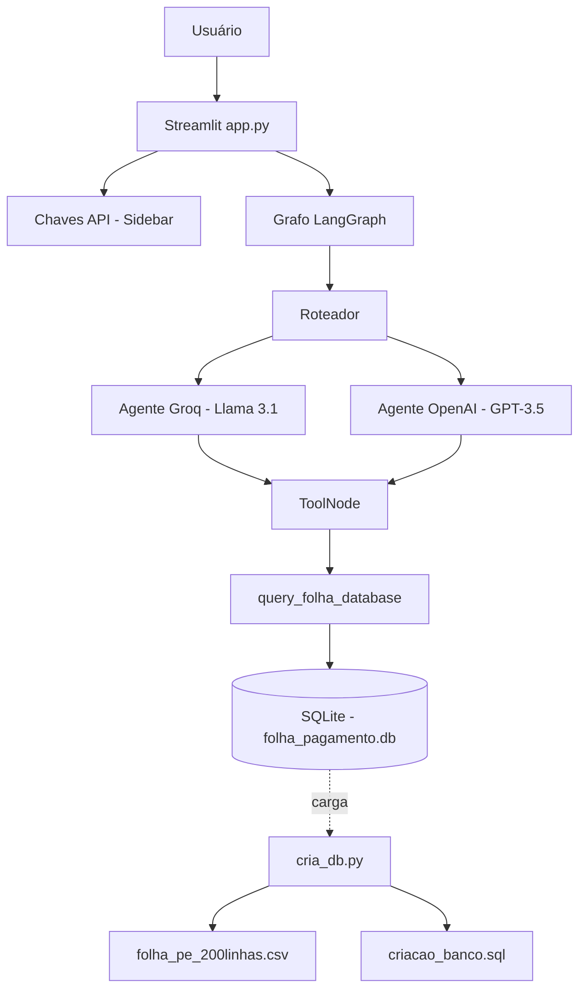
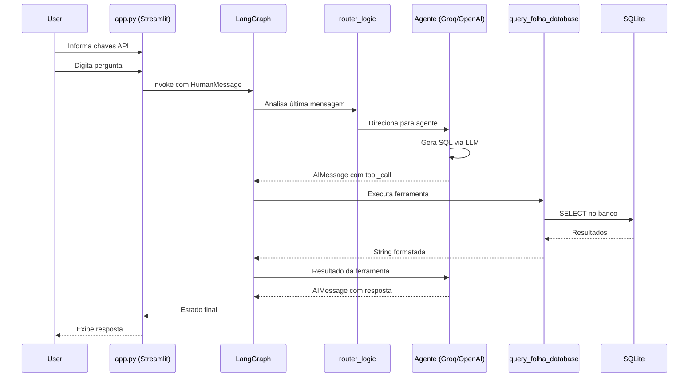

# Conversa_Folha_doc - Documentação do Código Python

Autor: Guttenberg Ferreira Passos  
Modelo LLM de referência do projeto: Claude Opus 4.6  
Ambiente validado: figmm  
Data: 29 de março de 2026

---

## 1. Escopo

Este documento descreve os módulos Python do projeto Conversa com a Folha identificados na pasta `Conversa_Folha/`. A documentação foi gerada por **análise estática**, sem alteração do código original.

## 2. Inventário Consolidado

| Módulo | Linhas | Classes | Funções | Responsabilidade |
| --- | ---: | ---: | ---: | --- |
| app.py | ~450 | 1 | 7 | Interface Streamlit, orquestração multiagente LangGraph, ferramenta SQL, roteamento |
| cria_db.py | ~100 | 0 | 3 | Criação e carga do banco de dados SQLite a partir de CSV |
| **TOTAL** | **~550** | **1** | **10** | — |

## 3. Arquitetura do Sistema

O Conversa com a Folha é um sistema multiagente conversacional com três camadas principais:

1. **Camada de Interface** — Streamlit (`app.py`) para interação com o usuário.
2. **Camada de Orquestração** — Grafo LangGraph (`app.py`) com roteamento entre agentes.
3. **Camada de Dados** — SQLite (`cria_db.py`, `criacao_banco.sql`) para armazenamento.

### 3.1 Diagrama de Componentes

### 3.2 Diagrama de Fluxo de Execução

## 4. Módulos Documentados

### 4.1 app.py

- **Propósito:** Interface Streamlit com orquestração multiagente LangGraph, ferramenta de consulta SQL e roteamento inteligente entre agentes.
- **Linhas analisadas:** ~450
- **Imports:** 15
- **Constantes globais:** 1 (DB_FILE)
- **Classes:** 1
- **Funções:** 7

#### Imports

- `os`
- `streamlit`
- `sqlite3`
- `operator`
- `from dotenv import load_dotenv`
- `from typing import Annotated, List, TypedDict`
- `from langchain_groq import ChatGroq`
- `from langchain_openai import ChatOpenAI`
- `from langchain_core.messages import BaseMessage, HumanMessage, AIMessage, ToolMessage`
- `from langchain_core.prompts import ChatPromptTemplate, MessagesPlaceholder`
- `from langgraph.graph import StateGraph, END, START`
- `from langgraph.prebuilt import ToolNode`
- `from langchain.tools import tool`

#### Constantes Globais

- `DB_FILE` = "folha_pagamento.db"

#### Classes

| Classe | Linha | Descrição |
| --- | ---: | --- |
| `AgentState` | ~30 | TypedDict que define o estado do grafo com campo messages |

#### Funções

| Função | Assinatura | Retorno | Descrição |
| --- | --- | --- | --- |
| `query_folha_database` | `(sql_query: str)` | `str` | Ferramenta @tool que executa SQL SELECT no SQLite e retorna resultados formatados |
| `cria_agente_runnable` | `(llm, system_prompt)` | agent_runnable | Cria um agente executável combinando LLM, prompt e ferramentas |
| `groq_agent_node` | `(state: AgentState)` | `dict` | Nó do grafo que executa o agente Groq (Llama 3.1) |
| `openai_agent_node` | `(state: AgentState)` | `dict` | Nó do grafo que executa o agente OpenAI (GPT-3.5-turbo) |
| `route_junction_node` | `(state: AgentState)` | `dict` | Nó hub de roteamento (sem mudança de estado) |
| `router_logic` | `(state: AgentState)` | `str` | Função de decisão de roteamento (groq_agent, openai_agent, tools, __end__) |
| `compila_grafo` | `()` | `app` | Compila o grafo LangGraph com todos os nós e arestas |

### 4.2 cria_db.py

- **Propósito:** Criação e carga do banco de dados SQLite a partir de CSV e script SQL.
- **Linhas analisadas:** ~100
- **Imports:** 5
- **Constantes globais:** 2 (DB_FILE, SQL_FILE)
- **Classes:** 0
- **Funções:** 3

#### Imports

- `os`
- `sqlite3`
- `pandas`
- `from datetime import datetime, timedelta`

#### Constantes Globais

- `DB_FILE` = "folha_pagamento.db"
- `SQL_FILE` = "criacao_banco.sql"

#### Funções

| Função | Assinatura | Retorno | Descrição |
| --- | --- | --- | --- |
| `cria_database` | `()` | `(conn, cursor)` | Cria o banco SQLite executando o script SQL |
| `popula_tabelas` | `(conn, cursor)` | `None` | Lê o CSV e insere dados nas tabelas via pandas |
| `main` | `()` | `None` | Função principal: chama cria_database e popula_tabelas |

### 4.3 criacao_banco.sql

- **Propósito:** DDL de criação das tabelas do banco de dados.
- **Tabelas criadas:** 2

| Tabela | Campos | Constraints |
| --- | --- | --- |
| tb_servidores | id (PK AUTOINCREMENT), nome, cpf, matricula (UNIQUE), orgao, cargo | PK, UNIQUE |
| tb_folha_pagamento | id (PK AUTOINCREMENT), matricula (FK), competencia, vencimentos, descontos, liquido | PK, FK |

## 5. Fluxos Operacionais Relevantes

1. `app.py` monta a interface Streamlit, coleta chaves de API, compila o grafo LangGraph e coordena o fluxo conversacional multiagente.
2. O roteador (`router_logic`) decide qual agente processa cada mensagem com base em menções (@groq/@openai) ou alternância automática.
3. Os agentes geram consultas SQL via LLM e invocam a ferramenta `query_folha_database`.
4. A ferramenta valida, executa e formata os resultados do SQLite.
5. `cria_db.py` é executado uma vez para criar e popular o banco a partir do CSV.

## 6. Dependências Externas Críticas

- **Groq API** — Backend LLM cloud para agente Groq (Llama 3.1-8b-instant).
- **OpenAI API** — Backend LLM cloud para agente OpenAI (GPT-3.5-turbo).
- **Streamlit** — Interface web para interação do usuário.
- **LangGraph / LangChain** — Framework de orquestração de agentes.
- **SQLite** — Banco de dados local para folha de pagamento.
- **pandas** — Leitura de CSV e carga de dados.

## 7. Observações de Governança

1. O código original da pasta `Conversa_Folha/` não foi alterado — documentação gerada por análise estática.
2. A documentação segue o template FACIN_IA com avaliação de maturidade, MRO_RACI e conformidade LGPD.
3. O modelo Claude Opus 4.6 foi utilizado para a geração documental; o código-fonte usa Groq e OpenAI.
4. Divergências e erros encontrados estão documentados na pasta `erros/`.
