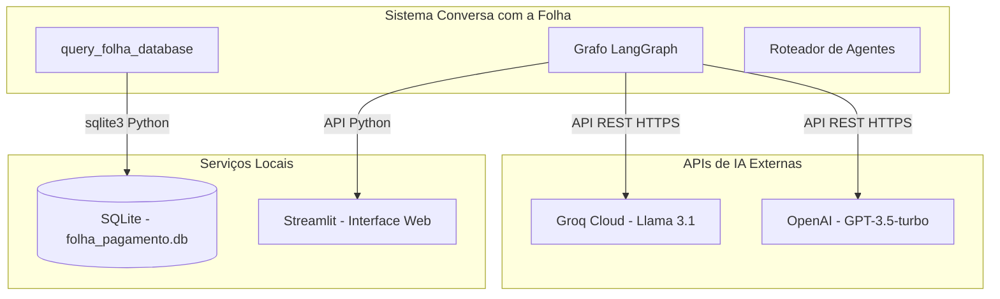
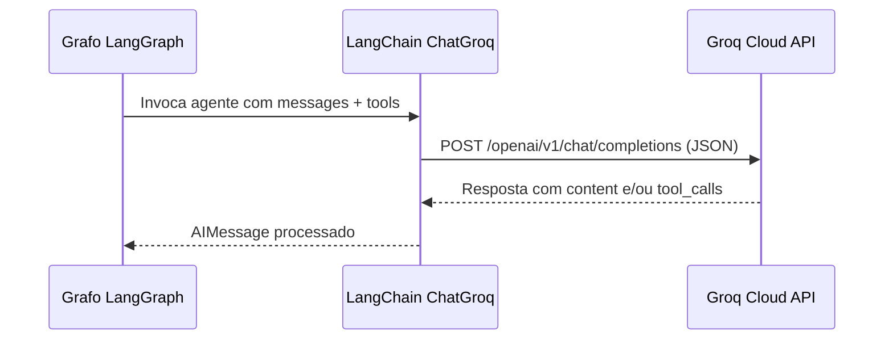
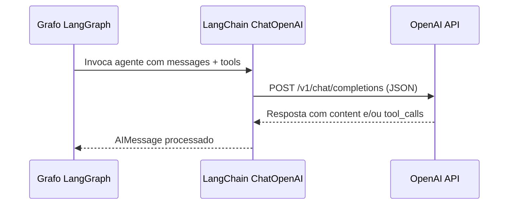
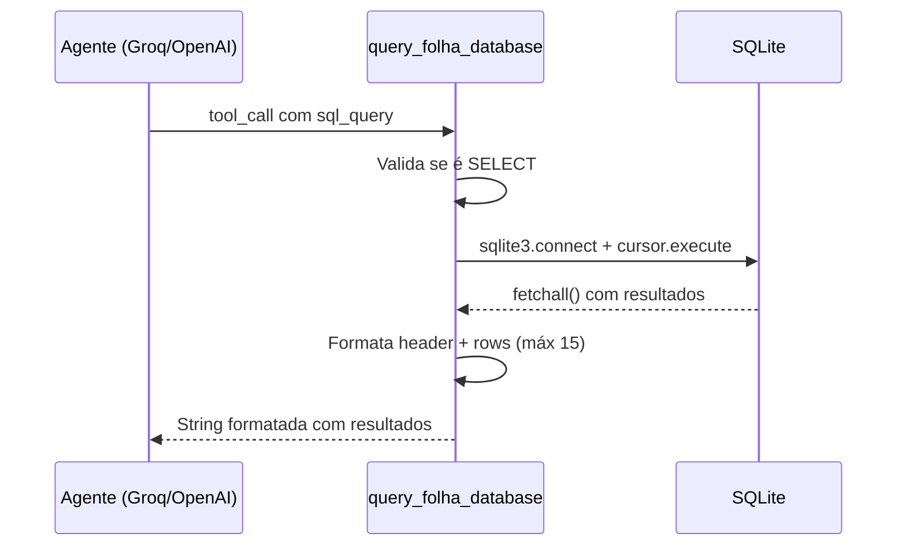
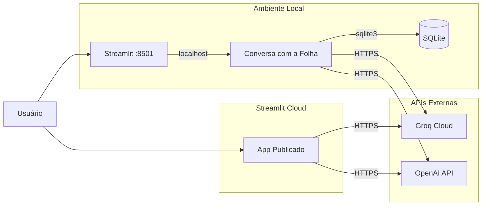

# Conversa_Folha_doc - Integrações

Autor: Guttenberg Ferreira Passos  
Modelo LLM de referência do projeto: Claude Opus 4.6  
Ambiente validado: figmm  
Data: 29 de março de 2026

---

## 1. Finalidade

Este documento mapeia todas as integrações externas e internas do sistema Conversa com a Folha, descrevendo protocolos, formatos de dados, fluxos de comunicação e requisitos de conectividade para cada ponto de integração.

---

## 2. Mapa de Integrações



---

## 3. Integrações Externas

### 3.1 API Groq (LLM Cloud)

| Aspecto | Especificação |
| --- | --- |
| Tipo | API REST externa |
| Protocolo | HTTPS |
| Endpoint | https://api.groq.com/openai/v1 |
| Modelo | llama-3.1-8b-instant |
| Autenticação | Bearer Token (API Key) |
| Formato de requisição | JSON (via LangChain ChatGroq) |
| Formato de resposta | JSON com texto gerado e tool_calls |
| Timeout | Padrão do SDK |

#### Fluxo de Comunicação com Groq



#### Situações de Integração

| Situação | Comportamento |
| --- | --- |
| Resposta direta | Retorna AIMessage com content |
| Chamada de ferramenta | Retorna AIMessage com tool_calls |
| Erro de API | Captura exceção, exibe st.error, retorna erro interno |

### 3.2 API OpenAI (LLM Cloud)

| Aspecto | Especificação |
| --- | --- |
| Tipo | API REST externa |
| Protocolo | HTTPS |
| Endpoint | https://api.openai.com/v1 |
| Modelo | gpt-3.5-turbo |
| Autenticação | Bearer Token (API Key) |
| Formato de requisição | JSON (via LangChain ChatOpenAI) |
| Formato de resposta | JSON com texto gerado e tool_calls |
| Timeout | Padrão do SDK |

#### Fluxo de Comunicação com OpenAI



### 3.3 Comparação entre APIs

| Aspecto | Groq | OpenAI |
| --- | --- | --- |
| Modelo | llama-3.1-8b-instant | gpt-3.5-turbo |
| Licença do modelo | Open Source (Meta) | Proprietário |
| Velocidade | Alta (hardware especializado) | Média |
| Custo | Tier gratuito disponível | Pay-per-use |
| Temperatura | 0.2 | 0.2 |
| Ferramentas | Suporta tool_calls | Suporta tool_calls |

---

## 4. Integrações Locais

### 4.1 SQLite (Banco de Dados)

| Aspecto | Especificação |
| --- | --- |
| Tipo | Banco de dados local |
| Protocolo | API Python sqlite3 (stdlib) |
| Arquivo | folha_pagamento.db |
| Autenticação | Nenhuma (acesso direto ao arquivo) |
| Operações permitidas | Somente SELECT |
| Timeout | Nenhum explícito |

#### Fluxo de Comunicação com SQLite



#### Tabelas Acessíveis

| Tabela | Colunas | Chave |
| --- | --- | --- |
| tb_servidores | id, nome, cpf, matricula, orgao, cargo | matricula (UNIQUE) |
| tb_folha_pagamento | id, matricula, competencia, vencimentos, descontos, liquido | FK → matricula |

#### Exemplos de SQL Gerado pelos Agentes

```sql
-- Listar servidores por órgão
SELECT nome, cargo FROM tb_servidores WHERE orgao = 'Secretaria da Saúde';

-- Consultar remuneração individual
SELECT competencia, vencimentos, descontos, liquido 
FROM tb_servidores s 
JOIN tb_folha_pagamento f ON f.matricula = s.matricula 
WHERE nome = 'Servidor 3' 
ORDER BY competencia DESC;

-- Contar servidores com aumento
SELECT COUNT(DISTINCT f1.matricula) AS total_servidores_com_aumento 
FROM tb_folha_pagamento AS f1 
WHERE f1.vencimentos > (
    SELECT f2.vencimentos FROM tb_folha_pagamento AS f2 
    WHERE f2.matricula = f1.matricula 
    AND f2.competencia < f1.competencia 
    ORDER BY f2.competencia DESC LIMIT 1
);
```

### 4.2 Streamlit (Interface Web)

| Aspecto | Especificação |
| --- | --- |
| Tipo | Framework web Python |
| Protocolo | HTTP local |
| Porta padrão | 8501 |
| Elementos utilizados | text_input, sidebar, write, error, warning, success, expander |
| Gerenciamento de estado | st.session_state |

#### Componentes de Interface

| Widget | Função |
| --- | --- |
| st.sidebar.text_input (password) | Entrada de chaves API |
| st.title | Títulos da aplicação |
| st.write | Exibição de mensagens |
| st.error / st.warning / st.success | Alertas ao usuário |
| st.sidebar.expander | Histórico da conversa |
| st.session_state | Persistência de app, chat_history, thread_id |

### 4.3 Integração entre LangGraph e Ferramentas

| Aspecto | Especificação |
| --- | --- |
| Padrão | Tool calling via LangChain @tool |
| Registro | Lista `tools = [query_folha_database]` |
| Executor | `ToolNode(tools)` do LangGraph-prebuilt |
| Vinculação ao LLM | `llm.bind_tools(tools)` no template de prompt |

---

## 5. Formato dos Contratos de Integração

### 5.1 Contrato de Estado (AgentState)

```python
class AgentState(TypedDict):
    messages: Annotated[List[BaseMessage], operator.add]
```

### 5.2 Contrato da Ferramenta SQL

**Entrada** (tool_call do agente):
```json
{
    "name": "query_folha_database",
    "args": {
        "sql_query": "SELECT nome, cargo FROM tb_servidores WHERE orgao = 'Secretaria da Saúde'"
    }
}
```

**Saída (sucesso)**:
```
Resultados da consulta (5 encontrados):
nome | cargo
Servidor 1 | Assistente
Servidor 6 | Assistente
...
```

**Saída (erro de segurança)**:
```
Erro: Esta ferramenta só pode executar consultas SELECT.
```

**Saída (erro SQL)**:
```
Erro ao executar a consulta SQL: no such table: xxx. Verifique a sintaxe da sua consulta e os nomes das tabelas/colunas.
```

---

## 6. Diagrama de Conectividade



---

## 7. Requisitos de Conectividade

| Integração | Tipo | Porta | Protocolo | Obrigatória |
| --- | --- | --- | --- | --- |
| Groq API | Externa | 443 (HTTPS) | REST | Sim |
| OpenAI API | Externa | 443 (HTTPS) | REST | Sim |
| SQLite | Local | N/A (arquivo) | sqlite3 | Sim |
| Streamlit | Local | 8501 | HTTP | Sim |
| Streamlit Cloud | Externa | 443 (HTTPS) | HTTP | Não (opcional para deploy) |

---

## 8. Observações de Governança

1. O sistema envia o conteúdo das perguntas do usuário para APIs externas (Groq e OpenAI).
2. Os dados do banco SQLite são retornados pelas ferramentas e potencialmente incluídos nas mensagens enviadas aos LLMs.
3. As chaves de API são gerenciadas em tempo de execução, sem persistência em disco.
4. Não há criptografia adicional além do HTTPS padrão das APIs.
5. Não há controle de acesso formal à interface Streamlit.
