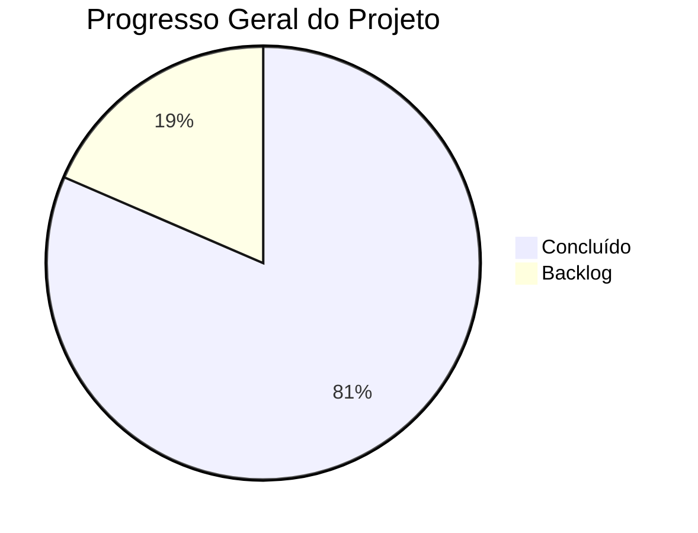

# Conversa_Folha_doc - Kanban Executivo

Autor: Guttenberg Ferreira Passos  
Modelo LLM de referência do projeto: Claude Opus 4.6  
Ambiente validado: figmm  
Data: 29 de março de 2026

---

## 1. Finalidade

Visão executiva resumida por épicos e marcos com semáforo de status para acompanhamento gerencial do projeto Conversa_Folha_doc.

---

## 2. Visão por Épicos

| Épico | Descrição | Status | Semáforo |
| --- | --- | --- | --- |
| E1 - Documentação Base | Projeto, Código, Manual | Concluído | 🟢 |
| E2 - Documentação Avançada | Arquitetura, Tecnologias, Integrações, Regras | Concluído | 🟢 |
| E3 - Governança e Maturidade | Avaliação FACIN_IA, MRO_RACI | Concluído | 🟢 |
| E4 - Conformidade e Risco | LGPD, ANPD, Risco Algorítmico | Concluído | 🟢 |
| E5 - Publicação | HTML, PDF, Índice, Dashboard | Concluído | 🟢 |
| E6 - Adequação de Segurança | Mascaramento CPF, Autenticação, LLM local | Não iniciado | 🔴 |

---

## 3. Visão por Marcos

| Marco | Entrega | Status |
| --- | --- | --- |
| M1 | Documentação Base Publicada (Sprint 1) | 🟢 Concluído |
| M2 | Documentação Avançada Completa (Sprint 2) | 🟢 Concluído |
| M3 | Avaliação de Maturidade FACIN_IA (Sprint 3) | 🟢 Concluído |
| M4 | Conformidade LGPD e Risco Algorítmico (Sprint 4) | 🟢 Concluído |
| M5 | Publicação Completa em 3 formatos (Sprint 5) | 🟢 Concluído |
| M6 | Adequação de Segurança e Privacidade | 🔴 Não iniciado |

---

## 4. Resumo Executivo

| Indicador | Valor |
| --- | --- |
| Progresso geral | 81% |
| Épicos concluídos | 5 de 6 |
| Marcos atingidos | 5 de 6 |
| Bloqueios ativos | 0 |
| Riscos críticos | 1 (RA-04: dados pessoais em APIs externas) |

---

## 5. Decisões Pendentes

| # | Decisão | Responsável | Prazo |
| --- | --- | --- | --- |
| D1 | Designar Patrocinador Executivo | Direção | A definir |
| D2 | Designar DPO / Encarregado de Dados | Direção | A definir |
| D3 | Aprovar migração para LLM local | Gestor do Projeto | A definir |
| D4 | Validar conformidade LGPD com jurídico | Analista de Governança | A definir |

---

## 6. Riscos em Acompanhamento

| Risco | Probabilidade | Impacto | Mitigação | Semáforo |
| --- | --- | --- | --- | --- |
| RA-04: Transferência de dados pessoais a APIs externas | Alta | Alto | Anonimizar dados ou migrar para LLM local | 🔴 |
| RA-02: Exposição indevida de dados pessoais | Alta | Alto | Mascaramento de CPF | 🔴 |
| Atraso na designação de papéis (PAT, DPO) | Alta | Médio | RACI provisional | 🟡 |
| Não conformidade LGPD | Média | Alto | Avaliação antecipada realizada | 🟡 |
| Ausência de testes automatizados | Alta | Médio | Implementar pytest | 🟡 |

---

## 7. Próximas Ações

| # | Ação | Responsável | Prioridade |
| --- | --- | --- | --- |
| 1 | Mascarar CPF no banco e na interface | Desenvolvedor | Alta |
| 2 | Anonimizar dados antes do envio às APIs | Desenvolvedor | Alta |
| 3 | Implementar logging persistente | Desenvolvedor | Alta |
| 4 | Adicionar disclaimer de IA na interface | Desenvolvedor | Média |
| 5 | Implementar autenticação Streamlit | Desenvolvedor | Média |
| 6 | Criar testes automatizados com pytest | Desenvolvedor | Média |
| 7 | Designar DPO e Patrocinador | Direção | Alta |
