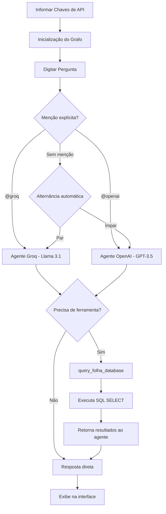

# Conversa_Folha_doc - Manual de Usuário

Autor: Guttenberg Ferreira Passos  
Modelo LLM de referência do projeto: Claude Opus 4.6  
Ambiente validado: figmm  
Data: 29 de março de 2026

---

## 1. Introdução

O **Conversa com a Folha** é um sistema multiagente de inteligência artificial que permite a consulta interativa e simulação sobre dados de folha de pagamento de servidores públicos. O sistema opera com dois agentes de IA — Groq (Llama 3.1) e OpenAI (GPT-3.5-turbo) — orquestrados por LangGraph, e fornece respostas baseadas em consultas SQL ao banco de dados SQLite.

### 1.1 Público-Alvo

- Gestores de recursos humanos e folha de pagamento
- Analistas de políticas públicas
- Equipe técnica de suporte ao sistema
- Auditores e controladores institucionais

### 1.2 Escopo do Manual

Este manual cobre a instalação, configuração, operação e solução de problemas do sistema Conversa com a Folha, contemplando a interface Web (Streamlit).

---

## 2. Requisitos do Sistema

### 2.1 Hardware Mínimo

| Requisito | Especificação |
| --- | --- |
| Processador | 2 cores, 2.0 GHz ou superior |
| Memória RAM | 4 GB (recomendado 8 GB) |
| Armazenamento | 2 GB livres |
| Rede | Conexão à internet (para APIs Groq e OpenAI) |

### 2.2 Software Necessário

| Software | Versão | Finalidade |
| --- | --- | --- |
| Python | 3.12 | Execução do sistema |
| Conda | Miniconda/Anaconda | Gerenciamento de ambiente |
| Navegador web | Moderno (Chrome, Firefox, Edge) | Acesso à interface Streamlit |

### 2.3 Dependências Python

As dependências estão registradas no arquivo `requirements.txt` e incluem:

- langchain, langchain-core, langchain-groq, langchain-openai
- langgraph
- streamlit
- sqlite3 (stdlib)
- pandas
- python-dotenv

---

## 3. Instalação e Configuração

### 3.1 Ativação do Ambiente

```bash
conda activate figmm
```

### 3.2 Instalação de Dependências

```bash
cd Conversa_Folha
pip install -r requirements.txt
```

### 3.3 Criação do Banco de Dados

Antes de iniciar a interface, é necessário criar e popular o banco de dados:

```bash
python cria_db.py
```

Este comando irá:
1. Ler o script SQL `criacao_banco.sql` para criar as tabelas
2. Importar os dados do arquivo `folha_pe_200linhas.csv`
3. Popular as tabelas `tb_servidores` e `tb_folha_pagamento`
4. Gerar arquivos auxiliares (`servidores.xlsx`, `servidores.csv`, `folha.xlsx`, `folha.csv`)

### 3.4 Chaves de API

O sistema requer duas chaves de API:

| Chave | Provedor | Onde Informar |
| --- | --- | --- |
| Groq API Key | [console.groq.com](https://console.groq.com) | Barra lateral da aplicação |
| OpenAI API Key | [platform.openai.com](https://platform.openai.com) | Barra lateral da aplicação |

**Importante**: As chaves são informadas em tempo de execução pela barra lateral. Nunca publique chaves reais no repositório.

---

## 4. Uso da Interface Web (Streamlit)

### 4.1 Inicialização

```bash
cd Conversa_Folha
streamlit run app.py
```

A interface será aberta automaticamente no navegador em `http://localhost:8501`.

### 4.2 Fluxo de Uso Completo

#### Passo 1: Informar Chaves de API

1. Na barra lateral, insira a **Groq API Key**.
2. Insira a **OpenAI API Key**.
3. Ambas as chaves são obrigatórias para prosseguir.

#### Passo 2: Aguardar Inicialização

1. O sistema compila o grafo LangGraph automaticamente.
2. A mensagem "Grafo Folha de Pagamento inicializado." confirma que o sistema está pronto.
3. O assistente exibe uma mensagem de boas-vindas.

#### Passo 3: Fazer Perguntas

1. No campo de entrada na parte inferior da tela, digite sua pergunta.
2. Pressione Enter para enviar.
3. O sistema direciona automaticamente para um dos agentes (Groq ou OpenAI).

#### Passo 4: Direcionar para Agente Específico

Para direcionar a pergunta a um agente específico, use menções:

| Comando | Efeito |
| --- | --- |
| `@groq` + pergunta | Direciona para o agente Groq (Llama 3.1) |
| `@openai` + pergunta | Direciona para o agente OpenAI (GPT-3.5-turbo) |
| Sem menção | Alternância automática entre os agentes |

#### Passo 5: Visualizar Resultados

O agente executa a consulta SQL e apresenta os resultados formatados com:
- Nomes das colunas como cabeçalho
- Dados separados por " | "
- Até 15 resultados por consulta
- Contagem total de registros encontrados

### 4.3 Diagrama do Fluxo de Uso



---

## 5. Exemplos de Perguntas

### 5.1 Consultas Básicas de Servidores

| Pergunta | Objetivo |
| --- | --- |
| Quais servidores estão ativos? | Listar todos os servidores cadastrados |
| Quantos servidores estão ativos? | Contar servidores |
| Qual é a remuneração do Servidor 2? | Consultar remuneração individual |
| Quantos servidores ocupam o cargo de Assistente? | Filtrar por cargo |
| Quantos servidores são da Secretaria da Saúde? | Filtrar por órgão |

### 5.2 Consultas de Folha de Pagamento

| Pergunta | Objetivo |
| --- | --- |
| Qual é o valor da folha da Fazenda em 202401? | Total por órgão e competência |
| Qual é o valor da folha da Saúde no ano de 2024? | Total anual por órgão |
| Quantos servidores tiveram aumento? | Análise temporal de remuneração |

### 5.3 Simulações

| Pergunta | Objetivo |
| --- | --- |
| Faça uma simulação da folha da Saúde para maio de 2024 | Projeção de valores |
| Qual seria o valor da folha da Fazenda se houvesse aumento de 10%? | Simulação de reajuste |

### 5.4 Consultas Avançadas

| Pergunta | Objetivo |
| --- | --- |
| Na Fazenda, quantos servidores ocupam o cargo de Assistente? | Filtro combinado |
| Qual o valor total da folha da Secretaria da Fazenda em 2024? | Agregação anual |
| Algum servidor foi demitido? Quais? | Análise de status |

---

## 6. Barra Lateral — Memória e Histórico

### 6.1 Histórico da Conversa

Na barra lateral, a seção **"📜 Ver Histórico Completo da Conversa"** permite:
- Visualizar todas as mensagens trocadas
- Acompanhar a sequência de perguntas e respostas
- Monitorar qual agente respondeu cada pergunta

### 6.2 Limpar Histórico

O botão **"🗑️ Limpar Histórico"** reinicia a conversa, removendo todas as mensagens anteriores.

---

## 7. Estrutura do Banco de Dados

### 7.1 Tabela `tb_servidores`

| Coluna | Tipo | Descrição |
| --- | --- | --- |
| id | INTEGER (PK) | Identificador único autoincremental |
| nome | TEXT | Nome do servidor |
| cpf | TEXT | CPF do servidor |
| matricula | TEXT (UNIQUE) | Matrícula funcional |
| orgao | TEXT | Órgão de lotação |
| cargo | TEXT | Cargo ocupado |

### 7.2 Tabela `tb_folha_pagamento`

| Coluna | Tipo | Descrição |
| --- | --- | --- |
| id | INTEGER (PK) | Identificador único autoincremental |
| matricula | TEXT (FK) | Matrícula do servidor |
| competencia | TEXT | Mês de referência (AAAAMM) |
| vencimentos | REAL | Valor bruto dos vencimentos |
| descontos | REAL | Valor total dos descontos |
| liquido | REAL | Valor líquido (vencimentos - descontos) |

### 7.3 Órgãos Disponíveis

- Secretaria da Saúde
- Secretaria da Fazenda
- Secretaria da Educação
- Secretaria de Administração

### 7.4 Cargos Disponíveis

- Assistente
- Analista
- Técnico
- Gestor

---

## 8. Solução de Problemas

### 8.1 Erros Comuns

| Erro | Causa | Solução |
| --- | --- | --- |
| "⚠️ Defina ambas as chaves" | Chaves de API não informadas | Insira ambas as chaves na barra lateral |
| "Arquivo do banco de dados não encontrado" | Banco não criado | Execute `python cria_db.py` |
| "Erro ao contactar a API Groq" | Chave Groq inválida ou sem créditos | Verifique a chave no console.groq.com |
| "Erro ao contactar a API OpenAI" | Chave OpenAI inválida ou sem créditos | Verifique a chave no platform.openai.com |
| "Erro ao executar a consulta SQL" | SQL gerado incorretamente pelo agente | Reformule a pergunta de forma mais clara |

### 8.2 Segurança SQL

O sistema implementa proteção contra injeção SQL:
- Somente consultas `SELECT` são aceitas
- Tentativas de `UPDATE`, `DELETE`, `INSERT` ou `DROP` são bloqueadas
- Erros de segurança são registrados no console

---

## 9. Limitações Conhecidas

1. O banco de dados contém dados de exemplo (200 registros), não dados reais
2. A alternância automática entre agentes pode não ser ideal para todas as perguntas
3. O sistema depende de conectividade com internet para acessar as APIs de IA
4. Límite de 15 resultados exibidos por consulta
5. Não há autenticação de usuário na interface Streamlit
6. As chaves de API são informadas manualmente a cada sessão

---

## 10. Observações de Governança

1. O código original da pasta `Conversa_Folha/` não foi alterado
2. A documentação segue o template FACIN_IA
3. O modelo Claude Opus 4.6 foi utilizado para a geração documental
4. O ambiente figmm é o ambiente oficial de trabalho
