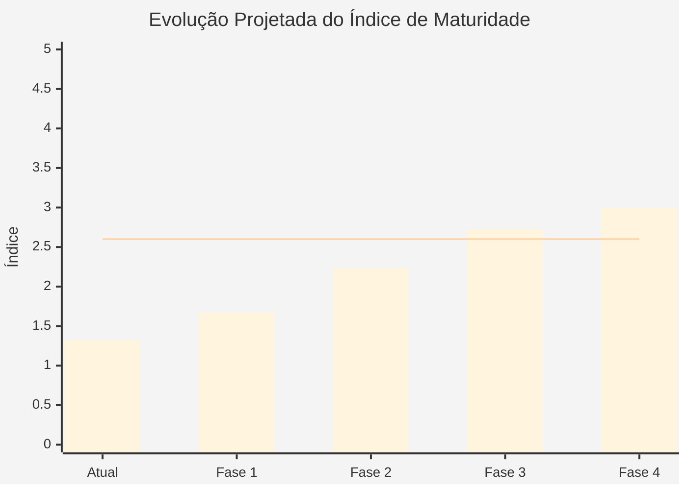
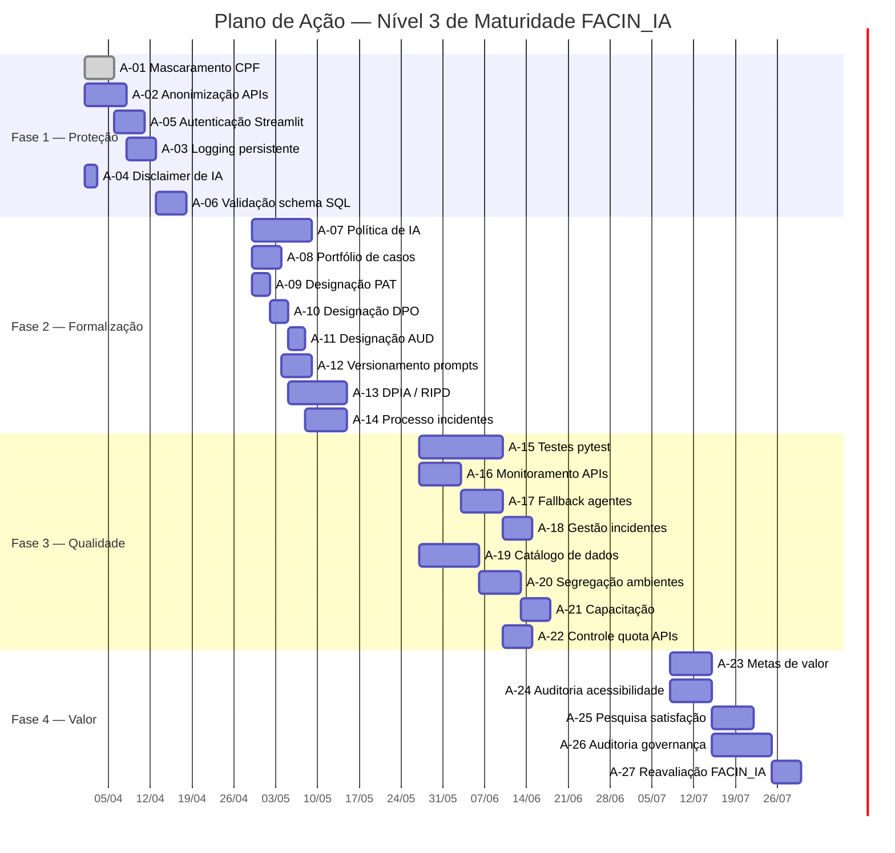

# Conversa_Folha_doc - Plano de Ação para Nível 3

Autor: Guttenberg Ferreira Passos  
Modelo LLM de referência do projeto: Claude Opus 4.6  
Ambiente validado: figmm  
Data: 29 de março de 2026

---

## 1. Objetivo

Definir o plano de ação necessário para elevar a maturidade de governança de IA do sistema **Conversa com a Folha — V4** do **Nível 1 (Inicial, índice 1,32)** para o **Nível 3 (Otimizado, índice ≥ 2,60)**, segundo o modelo FACIN_IA.

### 1.1 O que significa Nível 3

| Critério | Descrição |
| --- | --- |
| Classificação | Otimizado |
| Faixa de índice | acima de 2,6 a 3,4 |
| Definição | Formalizado, repetível e aplicado nas iniciativas principais |
| Implicação prática | Processos documentados, controles formais implantados, papéis designados, testes e monitoramento ativos, conformidade regulatória verificada |

### 1.2 Distância a Percorrer

| Dimensão | Peso | Atual | Meta (N3) | Gap |
| --- | ---: | ---: | ---: | ---: |
| EG — Estratégia e Governança de IA | 20% | 1,33 | 3,00 | +1,67 |
| DI — Dados e Infraestrutura | 15% | 1,33 | 3,00 | +1,67 |
| TC — Talento e Cultura | 15% | 1,00 | 3,00 | +2,00 |
| DO — DevOps/MLOps | 20% | 1,50 | 3,00 | +1,50 |
| ER — Ética, Transparência e Risco | 20% | 1,33 | 3,00 | +1,67 |
| IV — Impacto Social e Valor | 10% | 1,33 | 3,00 | +1,67 |
| **Índice ponderado** | **100%** | **1,32** | **3,00** | **+1,68** |

### 1.3 Simulação do Índice Meta

$$\text{Índice Meta} = (3{,}00 \times 0{,}20) + (3{,}00 \times 0{,}15) + (3{,}00 \times 0{,}15) + (3{,}00 \times 0{,}20) + (3{,}00 \times 0{,}20) + (3{,}00 \times 0{,}10) = 3{,}00$$

---

## 2. Princípios do Plano

1. **Especificação antes de código** — cada ação tem critério de aceite e evidência esperada antes da implementação.
2. **Rastreabilidade** — cada ação está vinculada ao indicador FACIN_IA, ao risco mitigado e ao responsável RACI.
3. **Proporcionalidade** — ações priorizadas pelo impacto no índice ponderado e pelo risco que mitigam.
4. **Incrementalidade** — organizado em 4 fases sequenciais, cada uma entregando valor verificável.

---

## 3. Estrutura de Fases

| Fase | Nome | Objetivo | Prazo Indicativo |
| --- | --- | --- | --- |
| Fase 1 | Proteção e Transparência | Eliminar riscos críticos e atender requisitos mínimos de LGPD | Semanas 1-4 |
| Fase 2 | Formalização Organizacional | Designar papéis, formalizar política e estabelecer processos | Semanas 5-8 |
| Fase 3 | Qualidade e Operação | Implementar testes, observabilidade e gestão de incidentes | Semanas 9-14 |
| Fase 4 | Valor e Melhoria Contínua | Medir impacto, validar conformidade e consolidar maturidade | Semanas 15-18 |

---

## 4. Fase 1 — Proteção e Transparência (Semanas 1-4)

**Objetivo**: Eliminar risco crítico RA-04, proteger dados pessoais e estabelecer transparência mínima.

### 4.1 Ações da Fase 1

| ID | Ação | Indicadores Impactados | Risco Mitigado | Responsável | Critério de Aceite | Evidência Esperada |
| --- | --- | --- | --- | --- | --- | --- |
| A-01 | Implementar mascaramento de CPF no retorno de consultas | DI2, ER2 | RA-02 | DEV | CPF exibido como `***.XXX.XXX-**` em todas as saídas | Código + teste manual + screenshot |
| A-02 | Anonimizar dados pessoais antes do envio às APIs externas | DI2, ER1 | RA-04 | DEV/ARQ | Nenhum CPF, nome ou remuneração enviado em texto claro às APIs | Teste de interceptação de payload + log |
| A-03 | Implementar logging persistente de consultas SQL | DO3, ER3 | RA-09 | DEV | Arquivo de log com timestamp, SQL, agente, resultado e usuário | Log rotacionado com 30 dias de retenção |
| A-04 | Adicionar disclaimer de IA na interface | ER2 | — | DEV | Aviso "Respostas geradas por IA — verifique os dados" visível antes da primeira interação | Screenshot da interface |
| A-05 | Implementar autenticação básica na interface Streamlit | DI2 | Incidente | DEV | Login obrigatório com usuário/senha antes do acesso | Tela de login + teste de acesso negado |
| A-06 | Validar schema SQL antes da execução de consultas | DO1 | RA-01 | DEV | Whitelist de tabelas e colunas aceitas; rejeição de referências fora do schema | Teste com consulta válida e inválida |

### 4.2 Impacto Estimado da Fase 1

| Indicador | Antes | Depois | Justificativa |
| --- | --- | --- | --- |
| DI2 | 1 | 3 | Mascaramento + anonimização + autenticação |
| DO1 | 2 | 3 | Validação de schema formalizada |
| DO3 | 2 | 3 | Logging persistente estruturado |
| ER1 | 1 | 2 | Anonimização implanta controle de risco |
| ER2 | 2 | 3 | Disclaimer + transparência dos agentes |

---

## 5. Fase 2 — Formalização Organizacional (Semanas 5-8)

**Objetivo**: Designar papéis críticos, formalizar política e estratégia de IA, estabelecer governança de portfólio.

### 5.1 Ações da Fase 2

| ID | Ação | Indicadores Impactados | Risco Mitigado | Responsável | Critério de Aceite | Evidência Esperada |
| --- | --- | --- | --- | --- | --- | --- |
| A-07 | Formalizar política institucional de IA | EG1 | — | PAT/GOV | Documento aprovado com princípios, escopo, responsabilidades e restrições | Política assinada + publicação interna |
| A-08 | Estabelecer portfólio formal de casos de uso | EG1, EG2 | — | GPR/GOV | Registro com caso de uso, classificação de risco, patrocinador e status | Planilha de portfólio + ata de aprovação |
| A-09 | Designar Patrocinador Executivo (PAT) | EG2, TC1 | — | Direção | Nomeação formal com atribuições documentadas | Ato de designação |
| A-10 | Designar Encarregado de Dados (DPO) | DI2, LGPD | — | Direção | Nomeação formal com atribuições de proteção de dados | Ato de designação + comunicação à ANPD |
| A-11 | Designar Auditor (AUD) | ER3, TC1 | — | PAT/GPR | Nomeação formal com escopo de auditoria definido | Ato de designação + plano de auditoria |
| A-12 | Implementar versionamento formal de prompts | EG3 | — | DEV/ARQ | Prompts versionados em arquivo separado com changelog | Arquivo prompts_v*.md + histórico Git |
| A-13 | Elaborar DPIA / RIPD | DI2, ER1, LGPD | RA-04 | GOV/DPO | Relatório de Impacto à Proteção de Dados publicado | Documento RIPD aprovado |
| A-14 | Criar processo formal de comunicação de incidentes | ER3, ANPD | Incidente | GOV/DPO | Fluxo documentado atendendo Resolução ANPD 19/2024 (3 dias úteis) | Procedimento + template de comunicação |

### 5.2 Impacto Estimado da Fase 2

| Indicador | Antes (Fase 1) | Depois | Justificativa |
| --- | --- | --- | --- |
| EG1 | 1 | 3 | Política de IA formalizada e publicada |
| EG2 | 1 | 3 | Portfólio com classificação e patrocínio |
| EG3 | 2 | 3 | Versionamento de prompts + rastreabilidade Git |
| TC1 | 1 | 3 | PAT, DPO e AUD designados formalmente |
| DI2 | 3 | 3 | DPIA complementa os controles da Fase 1 |
| ER1 | 2 | 3 | DPIA + processo de incidentes |
| ER3 | 1 | 3 | Processo de incidentes + auditor designado |

---

## 6. Fase 3 — Qualidade e Operação (Semanas 9-14)

**Objetivo**: Implantar testes automatizados, monitoramento, gestão de incidentes e capacitação formal.

### 6.1 Ações da Fase 3

| ID | Ação | Indicadores Impactados | Risco Mitigado | Responsável | Critério de Aceite | Evidência Esperada |
| --- | --- | --- | --- | --- | --- | --- |
| A-15 | Criar suite de testes automatizados (pytest) | DO2 | RA-01, RA-05 | DEV | ≥ 80% de cobertura em app.py e cria_db.py; testes de SQL injection, schema e roteamento | pytest --cov + relatório de cobertura |
| A-16 | Implementar monitoramento de disponibilidade das APIs | DI3 | RA-07 | DEV/ARQ | Health check periódico Groq/OpenAI com alerta por e-mail ou webhook | Dashboard de saúde + registro de alertas |
| A-17 | Implementar fallback entre agentes | DI3 | RA-07 | DEV/ARQ | Se Groq falhar, redirecionar para OpenAI (e vice-versa) automaticamente | Teste de failover + log de fallback |
| A-18 | Estabelecer processo de gestão de incidentes | DO4 | Incidente | GPR/GOV | Workflow documentado: detecção → triagem → resolução → post-mortem | Template de incidente + registro |
| A-19 | Implementar catálogo formal de dados e linhagem | DI1 | — | GOV/DEV | Dicionário de dados (tabelas, colunas, tipos, origens) + diagrama de linhagem | Documento publicado + diagrama Mermaid |
| A-20 | Implementar segregação de ambientes (dev/homol/prod) | TC3 | — | DEV/ARQ | 3 ambientes distintos com fluxo de promoção documentado | Configuração de ambientes + procedimento |
| A-21 | Executar programa de capacitação em governança de IA | TC2 | — | GPR/GOV | ≥ 1 trilha formativa aplicada à equipe do projeto com registro de participação | Lista de presença + material + avaliação |
| A-22 | Implementar controle de quota e custo de APIs | DO3 | RA-08 | DEV | Limite de requisições por sessão/dia com alerta ao atingir 80% | Log de uso + configuração de limites |

### 6.2 Impacto Estimado da Fase 3

| Indicador | Antes (Fases 1-2) | Depois | Justificativa |
| --- | --- | --- | --- |
| DO2 | 1 | 3 | pytest com ≥ 80% cobertura |
| DO4 | 1 | 3 | Processo de incidentes + MTTR documentado |
| DI1 | 2 | 3 | Catálogo formal + linhagem documentada |
| DI3 | 1 | 3 | Monitoramento + fallback + alertas |
| TC2 | 1 | 3 | Capacitação aplicada com registro |
| TC3 | 1 | 3 | 3 ambientes segregados |

---

## 7. Fase 4 — Valor e Melhoria Contínua (Semanas 15-18)

**Objetivo**: Medir impacto, consolidar acessibilidade, validar conformidade e garantir a nota ≥ 3 em todos os indicadores.

### 7.1 Ações da Fase 4

| ID | Ação | Indicadores Impactados | Risco Mitigado | Responsável | Critério de Aceite | Evidência Esperada |
| --- | --- | --- | --- | --- | --- | --- |
| A-23 | Definir e medir metas formais de valor | IV1 | — | GPR/PAT | ≥ 3 metas mensuráveis (ex: tempo de resposta, acurácia SQL, taxa de uso) com baseline e target | Dashboard de indicadores + relatório |
| A-24 | Realizar auditoria de acessibilidade | IV2 | — | DEV/GOV | Avaliação WCAG 2.1 nível A com plano de correção para itens reprovados | Relatório de auditoria + plano de ação |
| A-25 | Implementar pesquisa de satisfação do usuário | IV3 | — | GPR | Formulário in-app com ≥ 5 respostas coletadas e analisadas | Formulário + relatório de resultados |
| A-26 | Executar primeira auditoria de governança | ER3 | — | AUD | Relatório de auditoria cobrindo os 18 indicadores FACIN_IA | Relatório de auditoria assinado |
| A-27 | Reavaliação de maturidade FACIN_IA | Todos | — | GOV | Nova avaliação com índice ≥ 2,60 documentado | Avaliação completa publicada em .md/.html/.pdf |

### 7.2 Impacto Estimado da Fase 4

| Indicador | Antes (Fases 1-3) | Depois | Justificativa |
| --- | --- | --- | --- |
| IV1 | 2 | 3 | Metas formais definidas e medidas |
| IV2 | 1 | 3 | Auditoria WCAG + plano de correção |
| IV3 | 1 | 3 | Pesquisa implementada e analisada |
| ER3 | 3 | 3 | Auditoria realizada confirma a nota |

---

## 8. Projeção Completa de Notas

### 8.1 Projeção por Indicador

| Indicador | Descrição | Atual | Fase 1 | Fase 2 | Fase 3 | Fase 4 |
| --- | --- | ---: | ---: | ---: | ---: | ---: |
| EG1 | Política e estratégia de IA | 1 | 1 | **3** | 3 | 3 |
| EG2 | Portfólio de casos de uso | 1 | 1 | **3** | 3 | 3 |
| EG3 | Rastreabilidade de decisões | 2 | 2 | **3** | 3 | 3 |
| DI1 | Catálogo e linhagem | 2 | 2 | 2 | **3** | 3 |
| DI2 | Proteção de dados | 1 | **3** | 3 | 3 | 3 |
| DI3 | Disponibilidade infra | 1 | 1 | 1 | **3** | 3 |
| TC1 | Papéis críticos | 1 | 1 | **3** | 3 | 3 |
| TC2 | Capacitação | 1 | 1 | 1 | **3** | 3 |
| TC3 | Segregação ideação/produção | 1 | 1 | 1 | **3** | 3 |
| DO1 | Especificação antes de código | 2 | **3** | 3 | 3 | 3 |
| DO2 | Testes e validações | 1 | 1 | 1 | **3** | 3 |
| DO3 | Observabilidade | 2 | **3** | 3 | 3 | 3 |
| DO4 | MTTR | 1 | 1 | 1 | **3** | 3 |
| ER1 | Risco algorítmico | 1 | 2 | **3** | 3 | 3 |
| ER2 | Transparência | 2 | **3** | 3 | 3 | 3 |
| ER3 | Conformidade regulatória | 1 | 1 | **3** | 3 | **3** |
| IV1 | Metas de valor | 2 | 2 | 2 | 2 | **3** |
| IV2 | Acessibilidade | 1 | 1 | 1 | 1 | **3** |
| IV3 | Satisfação do usuário | 1 | 1 | 1 | 1 | **3** |

### 8.2 Projeção por Dimensão e Índice Geral

| Dimensão | Peso | Atual | Após F1 | Após F2 | Após F3 | Após F4 |
| --- | ---: | ---: | ---: | ---: | ---: | ---: |
| EG (3 indicadores) | 20% | 1,33 | 1,33 | 3,00 | 3,00 | 3,00 |
| DI (3 indicadores) | 15% | 1,33 | 2,00 | 2,00 | 3,00 | 3,00 |
| TC (3 indicadores) | 15% | 1,00 | 1,00 | 1,67 | 3,00 | 3,00 |
| DO (4 indicadores) | 20% | 1,50 | 2,00 | 2,00 | 3,00 | 3,00 |
| ER (3 indicadores) | 20% | 1,33 | 2,00 | 3,00 | 3,00 | 3,00 |
| IV (3 indicadores) | 10% | 1,33 | 1,33 | 1,33 | 1,33 | 3,00 |
| **Índice Geral** | **100%** | **1,32** | **1,67** | **2,23** | **2,73** | **3,00** |

### 8.3 Evolução Visual

---

## 9. Cronograma Gantt

---

## 10. Estimativa de Esforço

| Fase | Ações | Esforço (pessoa-semana) | Perfis Envolvidos |
| --- | ---: | ---: | --- |
| Fase 1 | 6 | 4 | DEV, ARQ |
| Fase 2 | 8 | 5 | PAT, GPR, GOV, DPO, DEV |
| Fase 3 | 8 | 8 | DEV, ARQ, GOV, GPR |
| Fase 4 | 5 | 4 | GPR, GOV, AUD, DEV |
| **Total** | **27** | **21** | — |

---

## 11. Dependências Críticas

| Dependência | Fase | Impacto se não resolvida |
| --- | --- | --- |
| Aprovação da Direção para designação de PAT e DPO | Fase 2 | Bloqueia EG2, TC1, DI2 (LGPD compliance) |
| Acesso a ferramenta de testes (pytest instalado) | Fase 3 | Bloqueia DO2 |
| Orçamento para capacitação | Fase 3 | Bloqueia TC2 |
| Colaboração do jurídico para DPIA | Fase 2 | Bloqueia ER1, conformidade LGPD |
| Disponibilidade do Auditor | Fase 4 | Bloqueia ER3, validação final |

---

## 12. Riscos do Plano

| Risco | Probabilidade | Impacto | Mitigação |
| --- | --- | --- | --- |
| Atraso na designação de PAT e DPO | Alta | Alto — Bloqueia Fase 2 | Escalar para Direção; RACI provisional |
| Resistência organizacional à política de IA | Média | Alto — Bloqueia EG1 | Workshop de sensibilização + benchmarks |
| Falta de orçamento para capacitação | Média | Médio — Bloqueia TC2 | Usar materiais gratuitos e internos |
| Indisponibilidade do Auditor | Média | Médio — Atrasa Fase 4 | Planejar auditoria com 30 dias de antecedência |
| Complexidade da migração para LLM local | Alta | Baixo (fora do escopo N3) | Não é requisito para Nível 3; priorizar anonimização |

---

## 13. Indicadores de Acompanhamento do Plano

| Indicador | Meta | Frequência | Responsável |
| --- | --- | --- | --- |
| Ações concluídas vs. planejadas | ≥ 90% por fase | Quinzenal | GPR |
| Índice de maturidade projetado | Progressão conforme §8.2 | Ao final de cada fase | GOV |
| Riscos com mitigação definida | 100% | Semanal | GPR |
| Bloqueios ativos | 0 | Semanal | GPR |
| Cobertura de testes | ≥ 80% | Ao final da Fase 3 | DEV |
| Papéis designados | 7 de 7 | Ao final da Fase 2 | GPR |
| Conformidade LGPD (nota) | ≥ 3,00 | Ao final da Fase 2 | GOV/DPO |

---

## 14. Critérios de Sucesso

O plano será considerado bem-sucedido quando:

1. **Todos os 18 indicadores** FACIN_IA alcançarem nota ≥ 3.
2. O **índice geral ponderado** for ≥ 2,60 (confirmado pela reavaliação A-27).
3. Todos os **7 papéis MRO_RACI** estiverem formalmente designados.
4. O **RIPD/DPIA** estiver publicado e aprovado.
5. A **suite de testes** apresentar cobertura ≥ 80%.
6. O **risco RA-04** (dados pessoais em APIs externas) estiver mitigado por anonimização.
7. A **primeira auditoria** de governança estiver concluída e documentada.

---

## 15. Observações

1. O Nível 3 não exige migração para LLM local — a anonimização de dados antes do envio às APIs é suficiente para mitigar o risco RA-04.
2. A nota 3 em cada indicador significa "formalizado, repetível e aplicado" — não "perfeito". A excelência é Nível 5.
3. Este plano não altera o código original da pasta `Conversa_Folha/`. As implementações devem ser feitas em branches ou forks governados.
4. A reavaliação (A-27) deve ser conduzida com o mesmo modelo de avaliação FACIN_IA para garantir comparabilidade.
5. Ações de Fase 1 podem ser iniciadas imediatamente, pois dependem apenas de desenvolvimento técnico.
