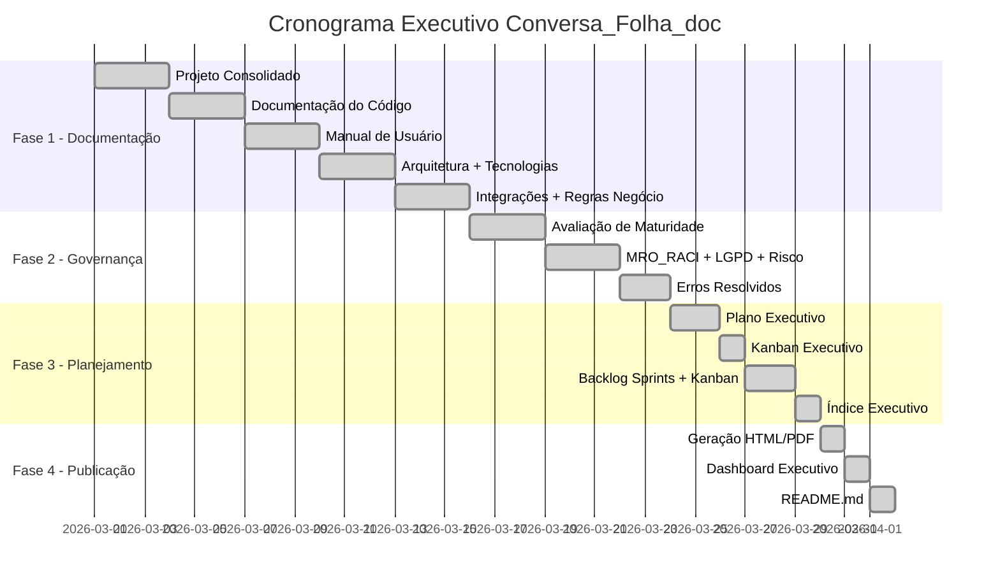

# Conversa_Folha_doc - Plano Executivo

Autor: Guttenberg Ferreira Passos  
Modelo LLM de referência do projeto: Claude Opus 4.6  
Ambiente validado: figmm  
Data: 29 de março de 2026

---

## 1. Objetivo Executivo

Traduzir a documentação técnica do sistema Conversa com a Folha de Pagamento — V4 em visão executiva com governança formal, matriz RACI no padrão FACIN_IA, cronograma de referência, esforço estimado, marcos e critérios de pronto, incluindo conformidade LGPD e risco algorítmico.

---

## 2. Escopo Executivo

### 2.1 Entregas Cobertas

| # | Entrega | Tipo |
| --- | --- | --- |
| 1 | Projeto Consolidado | Documental |
| 2 | Documentação do Código | Documental |
| 3 | Manual de Usuário | Documental |
| 4 | Arquitetura da Solução | Documental |
| 5 | Tecnologias | Documental |
| 6 | Integrações | Documental |
| 7 | Regras de Negócio | Documental |
| 8 | Avaliação de Maturidade FACIN_IA | Governança |
| 9 | Conformidade LGPD e ANPD | Regulatório |
| 10 | Avaliação de Risco Algorítmico | Governança |
| 11 | Backlog de Sprints e Kanban | Gestão |
| 12 | Plano Executivo e Kanban Executivo | Gestão |
| 13 | Publicação em .md, .html e .pdf | Operacional |

### 2.2 Fora de Escopo

- Alteração do código original na pasta `Conversa_Folha/`
- Implementação efetiva das ações do plano de adequação
- Migração para LLM local ou Microsoft Foundry
- Testes de penetração ou auditoria de segurança em produção

---

## 3. Princípios FACIN_IA Aplicados ao Plano

| # | Princípio | Aplicação |
| --- | --- | --- |
| 1 | Documentação como contrato | Todo artefato é rastreável e versionado |
| 2 | Código original preservado | Pasta `Conversa_Folha/` é somente leitura |
| 3 | Governança explícita | Matriz RACI, MRO e conformidade LGPD |
| 4 | Transparência e explicabilidade | Rastreabilidade de decisões e prompts |
| 5 | Conformidade regulatória | LGPD, ANPD Resolução 19/2024, risco algorítmico |

---

## 4. Estrutura de Governança Executiva

### 4.1 Papéis Executivos do Plano

| Papel | Responsabilidade | Status |
| --- | --- | --- |
| Patrocinador (PAT) | Aprovar escopo, aprovar entregas, garantir recursos | Não designado |
| Gestor do Projeto (GPR) | Coordenar execução, monitorar progresso, escalar riscos | Implícito |
| Arquiteto de IA (ARQ) | Definir arquitetura, validar padrões, revisar integrações | Implícito |
| Analista de Governança (GOV) | Avaliar maturidade, conformidade LGPD, risco algorítmico | Ativo (FACIN_IA) |
| Desenvolvedor (DEV) | Implementar documentação, gerar artefatos, executar testes | Ativo |
| Auditor (AUD) | Revisar aderência, validar critérios de aceite | Não ativado |
| Encarregado de Dados (DPO) | Proteção de dados pessoais, conformidade LGPD | Não designado |

### 4.2 Fórmula RACI Adotada

| Letra | Significado |
| --- | --- |
| R | Responsável pela execução |
| A | Accountable (aprova e responde pelo resultado) |
| C | Consultado (emite parecer técnico ou de negócio) |
| I | Informado (recebe comunicação sobre status) |

---

## 5. Matriz RACI FACIN_IA

| Entrega | PAT | GPR | ARQ | GOV | DEV | AUD | DPO |
| --- | --- | --- | --- | --- | --- | --- | --- |
| Projeto Consolidado | A | R | C | I | R | I | I |
| Documentação do Código | I | A | C | I | R | I | I |
| Manual de Usuário | I | A | C | I | R | C | I |
| Arquitetura da Solução | I | A | R | I | C | I | I |
| Tecnologias | I | I | R | I | C | I | I |
| Integrações | I | A | R | I | C | I | I |
| Regras de Negócio | C | A | C | C | R | I | I |
| Avaliação de Maturidade | A | C | C | R | C | C | I |
| Conformidade LGPD | A | I | C | R | I | C | R |
| Risco Algorítmico | A | I | C | R | C | C | C |
| Backlog e Kanban | I | R | I | I | C | I | I |
| Plano Executivo | A | R | C | C | I | I | I |
| Publicação (.md/.html/.pdf) | I | A | I | I | R | I | I |

---

## 6. Cronograma Executivo

### 6.1 Janela Indicativa

| Fase | Duração | Sprints |
| --- | --- | --- |
| Fase 1 — Documentação Base | 2 sprints | Sprint 1-2 |
| Fase 2 — Avaliação e Governança | 1 sprint | Sprint 3 |
| Fase 3 — Conformidade e Planejamento | 1 sprint | Sprint 4 |
| Fase 4 — Publicação e Dashboard | 1 sprint | Sprint 5 |

### 6.2 Cronograma por Fase

---

## 7. Estimativa de Esforço

### 7.1 Método de Estimativa

As estimativas de esforço foram produzidas com a técnica **Expert Judgment** (Julgamento Especialista), conforme descrito no *PMBOK® Guide — Seventh Edition* (PMI, 2021), seção 2.7.3 — Estimating, e complementada pela correspondência com a qualificação da demanda do **Modelo de Responsabilidade Organizacional (MRO_RACI)**.

### 7.2 Escala de Estimativa e Correspondência MRO

| Pontos | Significado | Pessoa-dia | Qualificação MRO | Critério de classificação |
| ---: | --- | --- | --- | --- |
| 1 | Item pequeno, baixa incerteza, baixo acoplamento | 0,5 a 1 | Operacional simples | 1-2 papéis ativos (R+A), demais I |
| 2 | Item simples, com uma dependência relevante | 1 a 2 | Operacional com dependência | 2-3 papéis ativos (R+A+C) |
| 3 | Item moderado, validação cruzada necessária | 2 a 3 | Tático com validação cruzada | 3-4 papéis ativos, inclui GOV ou AUD em C |
| 5 | Maior complexidade técnica ou institucional | 3 a 5 | Tático-institucional | 4-5 papéis ativos, inclui GOV ou DPO em R/C |
| 8 | Item crítico, maior risco, integração ou incerteza | 5 a 8 | Estratégico-crítico | 5+ papéis ativos, PAT em A, GOV+DPO+AUD |

A lógica de correspondência é: **quanto mais papéis organizacionais precisam ser acionados (R, A, C) para entregar um item, maior sua complexidade institucional e, portanto, maior a pontuação e o esforço**.

**Critérios complementares:**

| Critério | Descrição |
| --- | --- |
| Unidade | **Pessoa-dia** — 1 pessoa-dia = 8 horas efetivas de trabalho |
| Granularidade | Estimativa por frente de trabalho (épico), não por tarefa individual |
| Base de comparação | Esforço observado no projeto AGE_OPUS_4_6 (mesma metodologia FACIN_IA) |
| Premissa de produtividade | Geração assistida por LLM (Claude Opus 4.6) — produtividade ~3× superior à redação manual |
| Margem | Valores arredondados para cima em 0,5 pessoa-dia para absorver revisões |

### 7.3 Referências

1. Project Management Institute. *A Guide to the Project Management Body of Knowledge (PMBOK® Guide)* — Seventh Edition. PMI, 2021.
2. Project Management Institute. *Practice Standard for Scheduling* — Third Edition. PMI, 2019.
3. McConnell, S. *Software Estimation: Demystifying the Black Art*. Microsoft Press, 2006.
4. FACIN_IA_D_P_Foundry_Backlog_Sprints, seção 2.1 — Escala de Estimativa. Projeto FACIN_IA, 2026.

### 7.4 Esforço por Frente

| Frente | Esforço (pessoa-dia) | Qualificação MRO | Justificativa |
| --- | ---: | --- | --- |
| Documentação base (Projeto, Código, Manual) | 3 | Tático com validação cruzada | 3 documentos densos; análise de código + redação |
| Documentação avançada (Arq., Tec., Int., RN) | 4 | Tático-institucional | 4 documentos com diagramas Mermaid e 29 regras |
| Avaliação de Maturidade FACIN_IA (com MRO, LGPD, Risco) | 3 | Tático com validação cruzada | 18 indicadores + MRO_RACI + LGPD + 10 riscos |
| Erros Resolvidos | 1 | Operacional simples | 7 erros identificados e documentados |
| Plano Executivo + Kanban Executivo | 2 | Operacional com dependência | RACI + cronograma + épicos com semáforo |
| Backlog Sprints + Backlog Kanban | 1 | Operacional simples | Estrutura derivada dos épicos já definidos |
| Índice Executivo | 0,5 | Operacional simples | Compilação de links e resumo consolidado |
| Publicação (HTML, PDF, Dashboard) | 1 | Operacional simples | Script de conversão + Dashboard HTML manual |
| README.md | 0,5 | Operacional simples | Compilação da estrutura e instruções |
| **Total** | **16** | — | — |

---

## 8. Marcos Executivos

| Marco | Critério de Pronto | Fase |
| --- | --- | --- |
| M1 — Documentação Base | Projeto, Código e Manual publicados em .md | Fase 1 |
| M2 — Documentação Avançada | Arquitetura, Tecnologias, Integrações e Regras publicados | Fase 1 |
| M3 — Avaliação de Maturidade | 18 indicadores FACIN_IA, MRO_RACI, LGPD e risco documentados | Fase 2 |
| M4 — Planejamento | Plano Executivo, Kanban Executivo e Backlogs concluídos | Fase 3 |
| M5 — Publicação Completa | Todos os artefatos em .md, .html e .pdf + Dashboard | Fase 4 |

---

## 9. Critérios de Pronto por Fase

| Fase | Critérios |
| --- | --- |
| Fase 1 | Todos os documentos base e avançados existem em Português do Brasil |
| Fase 2 | Avaliação segue os 18 indicadores FACIN_IA com MRO_RACI, LGPD e risco |
| Fase 3 | Plano executivo com RACI, cronograma e marcos; Kanban com semáforo |
| Fase 4 | Artefatos publicados em 3 formatos; Dashboard HTML funcional |

---

## 10. Dependências Críticas

| Dependência | Tipo | Impacto |
| --- | --- | --- |
| Código-fonte `Conversa_Folha/` acessível | Técnica | Bloqueante para documentação |
| Ambiente figmm com Python 3.11+ | Infraestrutura | Bloqueante para geração |
| Pacotes `markdown` e `xhtml2pdf` instalados | Técnica | Bloqueante para HTML/PDF |
| Designação de papéis organizacionais | Organizacional | Necessário para RACI efetivo |

---

## 11. Principais Riscos Executivos

| Risco | Probabilidade | Impacto | Mitigação |
| --- | --- | --- | --- |
| Dados pessoais transferidos a APIs externas (RA-04) | Alta | Alto | Anonimizar dados ou migrar para LLM local |
| Exposição de CPF sem máscara (RA-02) | Alta | Alto | Implementar mascaramento |
| Atraso na designação de PAT e DPO | Alta | Médio | RACI provisional com revisão periódica |
| Não conformidade LGPD | Média | Alto | Avaliação antecipada realizada (nota 1,63) |
| Ausência de testes automatizados | Alta | Médio | Implementar pytest na próxima fase |

---

## 12. Indicadores Executivos de Acompanhamento

| Indicador | Meta | Atual | Status |
| --- | --- | --- | --- |
| Artefatos documentais entregues | 13 | 13 | 🟢 |
| Cobertura de módulos documentados | 100% | 100% | 🟢 |
| Índice de maturidade FACIN_IA | ≥ 2,50 | 1,32 | 🔴 |
| Conformidade LGPD | ≥ 3,00 | 1,63 | 🔴 |
| Riscos com mitigação definida | 100% | 100% | 🟢 |
| Papéis organizacionais designados | 7 | 3 | 🟡 |
| Bloqueios ativos | 0 | 0 | 🟢 |
