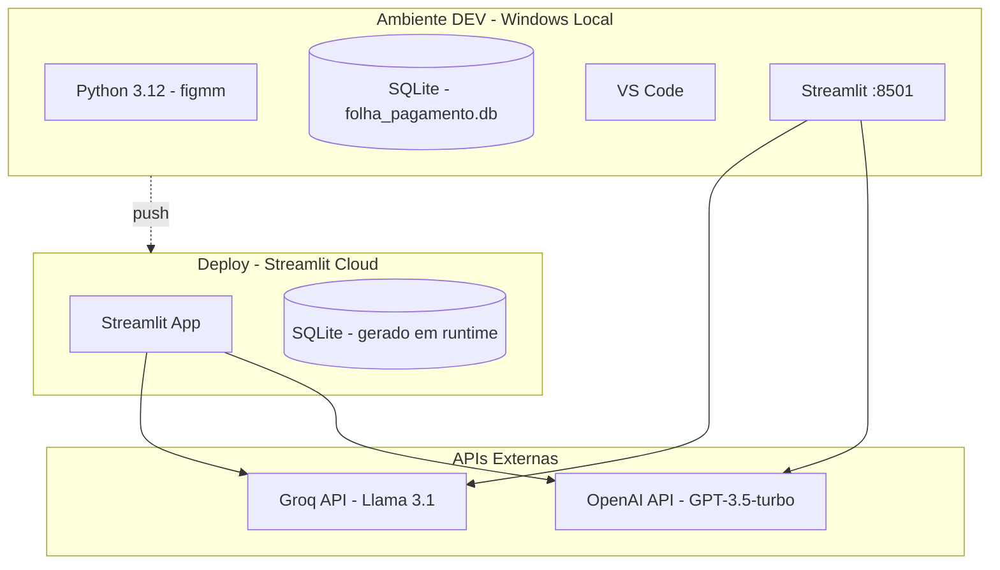
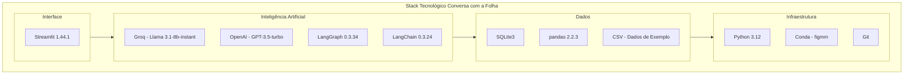

# Conversa_Folha_doc - Tecnologias

Autor: Guttenberg Ferreira Passos  
Modelo LLM de referência do projeto: Claude Opus 4.6  
Ambiente validado: figmm  
Data: 29 de março de 2026

---

## 1. Finalidade

Este documento apresenta o inventário completo do stack tecnológico utilizado no sistema Conversa com a Folha, incluindo linguagens, frameworks, modelos de IA, bibliotecas e infraestrutura.

---

## 2. Linguagem e Runtime

| Tecnologia | Versão | Finalidade |
| --- | --- | --- |
| Python | 3.12 | Linguagem principal do sistema |
| Conda (Anaconda) | Última estável | Gerenciamento de ambiente virtual |
| pip | Última estável | Gerenciamento de pacotes Python |

### 2.1 Ambiente Virtual

O ambiente oficial do projeto é o **figmm**, gerenciado via Conda:

```bash
conda activate figmm
```

---

## 3. Framework de Orquestração

| Tecnologia | Versão | Finalidade |
| --- | --- | --- |
| LangGraph | 0.3.34 | Construção e execução de grafos de agentes |
| LangChain | 0.3.24 | Abstrações para modelos de linguagem |
| LangChain-Core | 0.3.56 | Tipos centrais, mensagens e interfaces |
| LangChain-Groq | 0.3.2 | Integração com API Groq |
| LangChain-OpenAI | 0.3.14 | Integração com API OpenAI |
| LangGraph-Prebuilt | 0.1.8 | Nós pré-construídos (ToolNode) |

### 3.1 Padrão de Orquestração

O LangGraph implementa o padrão de **grafo de estado finito com roteamento multiagente** onde:

- Cada nó representa um agente ou ponto de decisão
- As transições são condicionais, baseadas no tipo de mensagem e menções
- O estado é tipado com `TypedDict` (`AgentState`) para contratos explícitos
- O campo `messages` acumula o histórico completo via `operator.add`

---

## 4. Modelos de Inteligência Artificial

### 4.1 Agente Groq

| Aspecto | Especificação |
| --- | --- |
| Modelo | llama-3.1-8b-instant |
| Provedor | Groq Cloud |
| Protocolo | API REST (HTTPS) |
| Temperatura | 0.2 |
| Autenticação | API Key (informada em tempo de execução) |

### 4.2 Agente OpenAI

| Aspecto | Especificação |
| --- | --- |
| Modelo | gpt-3.5-turbo |
| Provedor | OpenAI |
| Protocolo | API REST (HTTPS) |
| Temperatura | 0.2 |
| Autenticação | API Key (informada em tempo de execução) |

### 4.3 Parâmetros de IA

| Parâmetro | Valor | Descrição |
| --- | --- | --- |
| temperature | 0.2 | Baixa variabilidade nas respostas (mais determinístico) |
| Ferramentas vinculadas | query_folha_database | Ambos os agentes acessam a mesma ferramenta SQL |

---

## 5. Interface de Usuário

| Tecnologia | Versão | Finalidade |
| --- | --- | --- |
| Streamlit | 1.44.1 | Interface web interativa e conversacional |

### 5.1 Características da Interface Web

- Layout em largura total (`layout="wide"`)
- Barra lateral para chaves de API e histórico
- Widgets de senha para proteção de credenciais
- Expansor para histórico completo da conversa
- Gerenciamento de sessão via `st.session_state`
- Botão de limpeza de histórico

---

## 6. Banco de Dados

| Tecnologia | Versão | Finalidade |
| --- | --- | --- |
| SQLite | stdlib Python | Armazenamento local de dados de folha de pagamento |
| sqlite3 | stdlib Python | Driver nativo para acesso ao SQLite |

### 6.1 Modelo de Dados

| Tabela | Campos | Registros |
| --- | --- | --- |
| tb_servidores | id, nome, cpf, matricula, orgao, cargo | ~50 servidores |
| tb_folha_pagamento | id, matricula, competencia, vencimentos, descontos, liquido | ~200 registros |

### 6.2 Carga de Dados

| Tecnologia | Finalidade |
| --- | --- |
| pandas | Leitura do CSV e importação para SQLite |
| CSV (folha_pe_200linhas.csv) | Base de dados de exemplo |

---

## 7. Bibliotecas de Apoio

| Biblioteca | Versão | Finalidade |
| --- | --- | --- |
| pandas | 2.2.3 | Manipulação de dados tabulares e carga de CSV |
| python-dotenv | 1.1.0 | Carregamento de variáveis de ambiente (presente mas não ativo) |
| pydantic | 2.11.3 | Validação de dados e schemas |
| numpy | 2.2.5 | Operações numéricas |
| requests | 2.32.3 | Requisições HTTP |
| openai | 1.76.0 | SDK oficial da OpenAI |
| groq | 0.23.1 | SDK oficial da Groq |
| tiktoken | 0.9.0 | Tokenização para modelos OpenAI |
| PyYAML | 6.0.2 | Serialização YAML |

### 7.1 Bibliotecas Standard Library

| Biblioteca | Finalidade |
| --- | --- |
| os | Manipulação de caminhos e variáveis de ambiente |
| sqlite3 | Acesso ao banco de dados SQLite |
| operator | Operador de soma para agregação de mensagens |
| typing | Anotações de tipo (Annotated, List, TypedDict) |

---

## 8. Infraestrutura

### 8.1 Ambiente de Desenvolvimento (Local)

| Componente | Especificação |
| --- | --- |
| Sistema Operacional | Windows 10/11 |
| Python Runtime | Conda (figmm) com Python 3.12 |
| Banco de Dados | SQLite local (folha_pagamento.db) |
| IDE | VS Code |

### 8.2 Deploy em Nuvem (Streamlit Cloud)

| Componente | Especificação |
| --- | --- |
| Plataforma | Streamlit Community Cloud |
| URL | https://chatfolha-gp4chli5wpb4rfutyxx6zj.streamlit.app/ |
| Branch | main |
| Arquivo principal | app.py |

### 8.3 Diagrama de Infraestrutura



---

## 9. Geração de Documentação

| Tecnologia | Finalidade |
| --- | --- |
| markdown (Python) | Conversão de Markdown para HTML |
| xhtml2pdf | Conversão de HTML para PDF |
| ast (stdlib) | Análise estática de código Python |

---

## 10. Diagrama de Stack Tecnológico



---

## 11. Versões e Compatibilidade

| Componente | Versão Mínima | Versão Testada | Observação |
| --- | --- | --- | --- |
| Python | 3.10 | 3.12 | Requer suporte a TypedDict, Annotated |
| LangGraph | 0.3.x | 0.3.34 | API de StateGraph e ToolNode |
| LangChain | 0.3.x | 0.3.24 | ChatPromptTemplate e MessagesPlaceholder |
| Streamlit | 1.40+ | 1.44.1 | set_page_config, session_state |
| SQLite | 3.x | stdlib | Incluído no Python |

---

## 12. Observações de Governança

1. Todas as versões foram extraídas do arquivo `requirements.txt` do projeto original.
2. O sistema depende de APIs externas (Groq e OpenAI) para funcionamento dos agentes.
3. Os dados são processados localmente (SQLite), mas as perguntas são enviadas às APIs de IA.
4. O ambiente figmm é o único ambiente autorizado para instalações.
