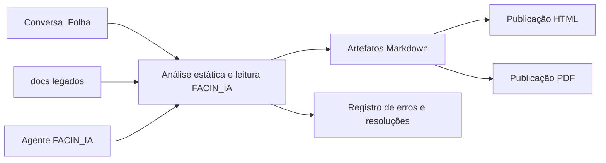

# Conversa_Folha_doc - Arquitetura-Alvo

Autor: Guttenberg Ferreira Passos  
Modelo LLM de referência: GPT-5.4  
Ambiente validado: figmm  
Data: 28 de março de 2026

## 1. Objetivo

Descrever a arquitetura-alvo da camada documental do projeto, separando claramente fontes consultivos, automação, publicação e rastreabilidade de achados.

## 2. Princípios

1. documentação precede qualquer proposta de mudança técnica;
2. o código original é fonte de verdade, mas permanece somente para consulta;
3. todo achado relevante gera artefato ou registro de erro;
4. a publicação deve ser reproduzível no ambiente figmm.

## 3. Diagrama da Arquitetura-Alvo Documental

## 4. Componentes

| Componente | Papel |
| --- | --- |
| Conversa_Folha | fonte consultiva de código, schema e exemplos |
| docs | publicação principal dos artefatos gerados |
| errors | trilha separada de achados e encaminhamentos |
| scripts/generate_project_docs.py | automação reprodutível de geração |
| .github/agents/FACIN_IA.agent.md | comportamento especializado do agente |

## 5. Resultado Esperado

Uma arquitetura documental simples, audível e desacoplada do legado, suficiente para governar a leitura do projeto e apoiar avaliações futuras.
