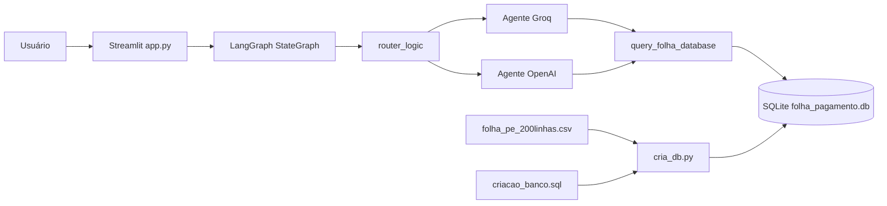

# Conversa_Folha_doc - Arquitetura da Solução

Autor: Guttenberg Ferreira Passos  
Modelo LLM de referência: GPT-5.4  
Ambiente validado: figmm  
Data: 28 de março de 2026

## 1. Visão Geral

A solução atual combina interface Streamlit, orquestração LangGraph, dois backends de LLM, ferramenta SQL somente leitura e banco SQLite local carregado a partir de CSV.

## 2. Diagrama da Solução Atual

## 3. Camadas

### 3.1 Interface

Responsável por coletar chaves de API, inicializar o grafo, manter histórico e apresentar a conversa ao usuário.

### 3.2 Orquestração

Responsável por alternar entre os agentes Groq e OpenAI, decidir chamadas de ferramenta e encerrar o ciclo quando houver resposta final.

### 3.3 Ferramenta de dados

Responsável por executar consultas SELECT no banco local, formatar o resultado e bloquear tentativas de escrita.

### 3.4 Persistência

Responsável por armazenar as tabelas de servidores e folha de pagamento derivadas do arquivo CSV de entrada.

## 4. Schema resumido

### 4.1 tb_servidores

- id INTEGER PRIMARY KEY AUTOINCREMENT
- nome TEXT
- cpf TEXT
- matricula TEXT UNIQUE
- orgao TEXT
- cargo TEXT

### 4.2 tb_folha_pagamento

- id INTEGER PRIMARY KEY AUTOINCREMENT
- matricula TEXT
- competencia TEXT
- vencimentos REAL
- descontos REAL
- liquido REAL

## 5. Observações Arquiteturais

1. o sistema depende de duas credenciais externas informadas manualmente;
2. o backend de dados é local, sem controles institucionais adicionais;
3. a orquestração privilegia alternância simples entre agentes e menções explícitas por @groq e @openai;
4. a camada documental criada no workspace passa a funcionar como suporte de governança da solução atual.
