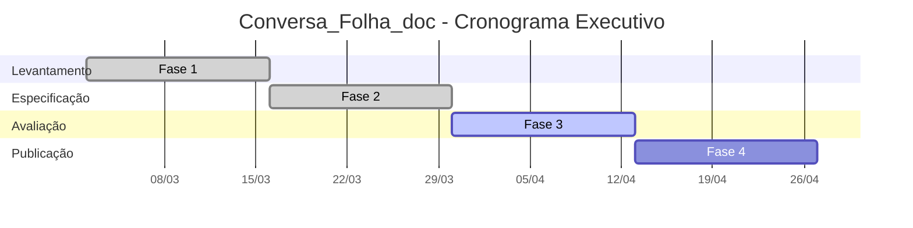

# Conversa_Folha_doc - Plano Executivo

Autor: Guttenberg Ferreira Passos  
Modelo LLM de referência: GPT-5.4  
Ambiente validado: figmm  
Data: 28 de março de 2026

## 1. Objetivo Executivo

Traduzir a iniciativa documental em um plano governado por entregas, responsáveis, cronograma, marcos e indicadores, mantendo foco exclusivo na documentação e na avaliação de maturidade do sistema atual.

## 2. Escopo Executivo

O plano cobre levantamento, análise, formalização FACIN_IA, produção dos artefatos, registro de achados e publicação final em três formatos. Não cobre reengenharia da aplicação, migração de runtime ou adequação a plataforma corporativa específica.

## 3. Papéis do Plano

| Sigla | Papel | Responsabilidade principal |
| --- | --- | --- |
| PAT | Patrocinador | valida escopo, prioridade e leitura executiva |
| GP | Gestão do Projeto | coordena artefatos, cronograma e integração entre frentes |
| ARQ | Arquitetura e IA | conduz análise técnica, leitura estrutural e coerência FACIN_IA |
| DOC | Documentação | redige, revisa e publica os artefatos |
| DADOS | Dados | valida schema, carga, qualidade e uso informacional |
| PRIV | Privacidade e Conformidade | revisa LGPD, resolução ANPD e risco algorítmico |
| NEG | Negócio | valida regras, exemplos de uso e aderência funcional |
| OPS | Operação | valida executabilidade do gerador e publicação dos artefatos |

## 4. Matriz RACI do Projeto Documental

| Entrega | PAT | GP | ARQ | DOC | DADOS | PRIV | NEG | OPS |
| --- | --- | --- | --- | --- | --- | --- | --- | --- |
| Definição do escopo documental | A | R | C | C | I | C | C | I |
| Inventário dos fontes e schema | I | C | A | R | R | I | C | I |
| Produção dos artefatos em md | I | C | C | A | C | C | C | I |
| Conversão para html e pdf | I | I | C | R | I | I | I | A |
| Avaliação de maturidade FACIN_IA | I | C | A | R | C | R | C | I |
| Conformidade LGPD e risco algorítmico | I | C | C | C | C | A | C | I |
| Registro de erros e resoluções | I | A | C | R | C | C | I | C |
| Publicação do índice executivo final | I | A | C | R | I | I | I | C |

## 5. Cronograma Executivo

| Fase | Semanas | Objetivo | Saída esperada |
| --- | --- | --- | --- |
| Fase 1 - Levantamento | 1 a 2 | mapear código, schema, docs e restrições | baseline analítico fechado |
| Fase 2 - Especificação | 3 a 4 | produzir projeto, plano, arquitetura e regras | pacote técnico inicial publicado |
| Fase 3 - Avaliação | 5 a 6 | consolidar maturidade, MRO_RACI, LGPD e riscos | parecer de maturidade emitido |
| Fase 4 - Publicação | 7 a 8 | converter, revisar e indexar artefatos | pacote final em md, html e pdf |

## 6. Indicadores Executivos

1. percentual de artefatos previstos já publicados;
2. percentual de artefatos com versão md, html e pdf disponível;
3. quantidade de achados documentais registrados e tratados;
4. percentual de dimensões FACIN_IA avaliadas com evidência explícita;
5. tempo médio de regeneração completa da documentação.

## 7. Marcos Executivos

| Marco | Semana-alvo | Critério |
| --- | --- | --- |
| M1 - Escopo confirmado | 1 | fontes e restrições validados |
| M2 - Inventário técnico concluído | 2 | código e schema mapeados |
| M3 - Pacote documental principal | 4 | documentos centrais redigidos |
| M4 - Parecer de maturidade | 6 | avaliação FACIN_IA publicada |
| M5 - Publicação final | 8 | todos os formatos gerados e indexados |

## 8. Decisões Recomendadas

1. manter o uso do gerador documental como mecanismo oficial de regeneração;
2. tratar a pasta errors como trilha de auditoria dos achados sobre o legado;
3. revisar periodicamente o agente FACIN_IA junto com a avaliação de maturidade;
4. só avançar para mudanças de implementação após aprovação formal do pacote documental.
