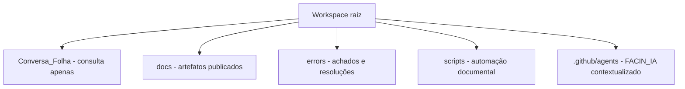

# Conversa_Folha_doc - Projeto

Autor: Guttenberg Ferreira Passos  
Modelo LLM de referência: GPT-5.4  
Ambiente validado: figmm  
Data: 28 de março de 2026

## 1. Identificação do Projeto

- Projeto: Conversa_Folha_doc
- Domínio: engenharia de software, inteligência artificial e políticas públicas
- Responsável: Guttenberg Ferreira Passos
- Base metodológica: FACIN, Modelo de Responsabilidade Organizacional e Spec-Driven Development
- Escopo desta entrega: documentação e avaliação de maturidade do sistema Conversa com a Folha, sem alteração do código original

## 2. Objetivo

Estruturar uma camada documental governada para o sistema Conversa com a Folha, produzindo artefatos rastreáveis em Markdown, HTML e PDF a partir dos fontes existentes na pasta Conversa_Folha e das referências já publicadas em docs.

## 3. Fontes Consultadas

1. Conversa_Folha/app.py.
2. Conversa_Folha/cria_db.py.
3. Conversa_Folha/criacao_banco.sql.
4. Conversa_Folha/README.md e Conversa_Folha/LEIAME.txt.
5. Artefatos de referência existentes na pasta docs.
6. Configuração do agente FACIN_IA na pasta .github/agents.

## 4. Especificação Funcional

A documentação produzida nesta iniciativa deve:

1. preservar integralmente os fontes originais da pasta Conversa_Folha apenas para consulta;
2. descrever a arquitetura atual da aplicação Streamlit e de sua camada de dados SQLite;
3. registrar integrações com modelos de linguagem, regras de negócio, tecnologia e fluxo operacional;
4. aplicar o FACIN_IA à avaliação de maturidade institucional do projeto;
5. explicitar riscos algorítmicos, premissas de LGPD e responsabilidades pelo ciclo documental;
6. manter registro separado dos erros encontrados e resolvidos por via documental.

## 5. Especificação Técnica

### 5.1 Escopo de análise estática

Foram analisados 2 módulos Python e 2 artefatos estruturais de banco de dados no diretório consultivo, sem modificação de conteúdo.

### 5.2 Estratégia de publicação

1. gerar arquivos Markdown como fonte principal de governança;
2. converter cada artefato para HTML navegável;
3. converter cada artefato para PDF institucional;
4. publicar o registro de erros em pasta própria, na raiz do workspace.

### 5.3 Estrutura-alvo do workspace documental

## 6. Critérios de Aceitação

1. o código original em Conversa_Folha permanece inalterado;
2. todos os artefatos novos são publicados em Português do Brasil;
3. a cobertura documental é, no mínimo, equivalente à malha já existente na pasta docs;
4. a avaliação de maturidade inclui FACIN_IA, MRO_RACI, LGPD, Resolução CD/ANPD nº 19/2024 e risco algorítmico;
5. existem documentos separados para manual de usuário, arquitetura da solução, tecnologias, integrações e regras de negócio;
6. existe pasta errors com registro formal dos achados e encaminhamentos adotados;
7. a automação documental executa no ambiente figmm.

## 7. Testes Derivados

1. verificar existência dos arquivos .md, .html e .pdf para cada artefato gerado;
2. verificar que o índice executivo referencia todos os artefatos publicados;
3. verificar que o relatório de maturidade contém as seis dimensões do FACIN_IA;
4. verificar que o relatório de erros registra achado, impacto e resolução documental;
5. verificar que a documentação do código cobre app.py e cria_db.py;
6. verificar que o agente FACIN_IA contextualizado está presente no workspace.

## 8. Restrições de IA

1. nenhuma mudança é aplicada aos fontes em Conversa_Folha;
2. o ambiente autorizado para execução e instalações é exclusivamente figmm;
3. o modelo de referência do projeto é GPT-5.4;
4. a documentação deve priorizar rastreabilidade, auditabilidade e clareza institucional;
5. a aderência a plataformas corporativas específicas foi explicitamente desconsiderada nesta entrega.

## 9. Conclusão Executiva

Conversa_Folha_doc consolida uma camada documental governada sobre o sistema Conversa com a Folha, tratando documentação, maturidade e conformidade como artefatos primários. O resultado serve para leitura executiva, técnica e regulatória, preservando o legado e elevando a inteligibilidade do projeto.
